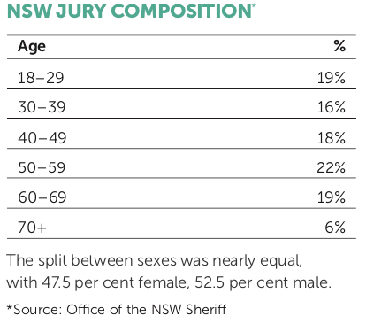
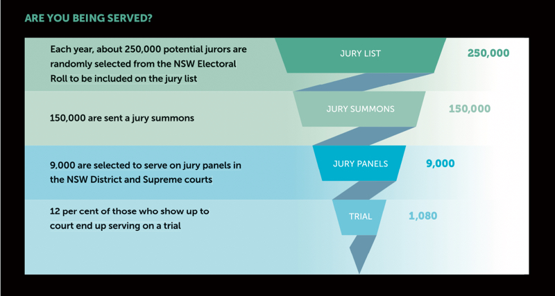

*As society and the world evolves, are juries keeping up with the times? LYNN ELSEY investigates.*

The jury trial system has attracted its fair share of scrutiny and criticism throughout the centuries. But an increased volume of complex cases and use of experts, lengthier trials and the ease of access to external information in recent years have led to growing concerns about the capacity of jurors to truly understand and undertake their duties. In short, is the jury system still working or does it need fixing?

**Setting the scene**

The NSW jury trial system, which is based on Section 80 of the Constitution (which, in turn, is based on the US Constitution) states that the “trial on indictment of any offence against any law of the Commonwealth shall be by jury” and that any person charged with a serious offence is entitled to have his or her innocence or guilt determined by their peers.

The 12 ordinary citizens who comprise a normal jury are deemed to be representative of the community. Because the jury process is secret, jurors are presumed to consider the case based on community values rather than external pressures, eliminating problems or perceptions that a judge or magistrate, for example, could be biased, side with authority, or are removed from the day-to- day life of ordinary people.

Research has found that judges who regularly hear criminal prosecutions without juries become “case-hardened” and are biased towards prosecution (Graham Fricke QC, “Trial by Jury”, Parliamentary Research Paper 1996-97).

**Jury selection**

Juror anonymity is a feature of NSW criminal trial process, in stark contrast to other jurisdictions, such as the US, where attorneys receive information on prospective jurors and are allowed to question them about their values and beliefs. In the US, jury selection in high-profile cases often involves jury consultants who undertake an array of methods to try to uncover details about the prospective jurors.

In NSW, however, jurors are identified only by a number, so challenges are based solely on what the person looks like.

Following concerns that juries were mainly comprised of students, housewives and retirees, in recent years efforts have been made to try to ensure that a jury is more reflective of the community, including making it more difficult for people to avoid serving.

“There seems to be more diversity on juries now, due to changes in who can serve and possibly that grounds for exemption are more difficult to get,” says Professor Nicholas Cowdery, AM QC, who served as the Director of Public Prosecutions for NSW from 1994-2011.

Recent statistics from the NSW Sheriff back his observations. From February 2016 to February 2017, 81 per cent of jurors were employed, with ages fairly evenly spread across groups:

 

**REPUTATION MATTERS**

*In the US, the jury selection process for a recent securities and wire transfer fraud trial became an elaborate and at times humourous ordeal due to the reputation of the accused, Martin Shkreli.*

*Two years earlier, as CEO of a pharmaceutical company, Shkreli had hit the headlines and been called “the most hated man in America” when his company raised the price of two essential pharmaceuticals, an emergency allergy injection and an AIDS drug, by 400 and 5,000 per cent.*
 *The jury selection process for Shkreli’s fraud trial (which was unrelated to the pharmaceutical company) became a cause célèbre, lasting three days and involving 200 potential jurors being excused.*

*Some of the reasons potential jurors felt they couldn’t be fair and impartial included:*

- *I think he’s a greedy little man*
- *He’s the most hated man in America*
- *From everything I’ve seen on the new, everything I’ve read, I believe the defendant is the face of corporate greed in America*
- *You’d have to convince me he was innocent rather than guilty*
- *He is as guilty as they come*
- *The only thing I’d be impartial about is what prison this guy goes to.*

 

**Trial length**

Trials are getting longer, which means jurors are required to hear and retain more information and have a longer time between hearing evidence and deliberating. This trend also affects the number of potential jurors and their ability to commit to a lengthier trial.

From 1995 to 2011, the mean trial length in the NSW District Court increased by 60 per cent, from 5.47 to 8.79 days, according to the NSW Law Reform Commission.

Supreme Court cases involving charges of murder, attempted murder, manslaughter and driving causing death also have lengthened. In 1990, the mean trial length was 12 days; in 2010 it was 26 days.

In 2017, the NSW Bureau of Crime Statistics and Research released a brief showing that the average trial was 8.2 days, although length varied significantly depending on location and the type of trial. For example, the shortest trials were in Wagga Wagga (4.8 days on average) and the longest were held in Sydney (10.6 days).

Longer trials affect the expectations and pressures of jurors. Trial advocate Manny Conditsis, who once had Man Haron Monis as a client, has noticed a change in attention spans and interest over the past 10 years.

“Everyone has always been busy but the impact of social media means that now a significant number of jurors, while still a minority, don’t seem to be interested,” Conditsis observes.

“A greater number appear to be frustrated with interruptions to their lives and having to keep coming back to court than in the past.”

Barrister David Staehli SC, who was the Crown Prosecutor in the Oliver Curtis insider trading case, also feels that lengthy trials are a potential problem. “The longer the trial, the more likely jurors will become frustrated with the inconvenience or fall out with each other, and be less likely to remember evidence they may have heard months before.”

“Among a lot of young people, there seems to be a sense of entitlement and a feeling that ‘I’ve done my few days, I’ve formed my opinions and now I want to get back to my life’.”

***“The longer the trial, the more likely jurors will become frustrated with the inconvenience or fall our with each other.”***

DAVID STAEHLI SC

***“If you make an application for a judge-only trial, it is certainly a gamble. With a jury, the prosecution has to persuade 12 jurors ‘beyond reasonable doubt’; with a judge, only one mind has to be convinced.”***
MANNY CONDITSIS

**Challenges of complexity**

The capacity of juries to adequately fulfil their duties due to a growing complexity in cases, from use of DNA evidence to details on insider trading, is another area of concern. “It is true, in general, that trials are becoming longer and more detailed,” says Cowdery. “For example, fraud trials, and cases with medical and psychiatric issues often turn into a contest between experts.

“The run-of-the-mill trials are dropping out; these matters don’t actually go to trial as much. There are more guilty pleas, even in murder cases, due to the removal of mandatory life sentences.”

As trials lengthen, jurors are being asked to handle more. But Cowdery remains optimistic. “I think the problems can be managed and that, by and large, jury trials are successful,” he observes. “In many cases, the issue is whether the accused acted dishonestly. Values, such as reasonableness, should also be determined by the representatives of the community. If counsel and the judge do their job, ordinary people can be enabled to understand to do their job.”

The increased use of experts means judges and counsel may need to undertake additional work to ensure a jury understands the evidence and the position of the expert, he says. “Ultimately, an expert is expressing his or her opinion, which can be accepted or dismissed.”

Staehli says increasing levels of complexity are not just a challenge for jurors. “Lawyers also battle with understanding complex charges and how to convey the issues to jurors,” he says.

Nonetheless, Staehli hasn’t noticed any specific challenges regarding complex cases. “In the past two years, I haven’t detected any problems that jurors have with complexity.” But, he points out, the only way to determine this in a trial is from questions the jury asks.

James Ogloff, a professor and director of the Centre for Forensic Behavioural Science at Swinburne University of Technology, who also trained as a lawyer, disagrees.

Ogloff has been studying juries for more than 30 years. He says research shows that many jurors struggle to understand the legal instructions from judges and the concept of “beyond reasonable doubt”.

“A judge is trained to analyse evidence, to give proper weight to some evidence over other evidence, to assess witnesses veracity, to probe the arguments put by counsel, and is less likely to be swayed by emotive rhetoric,” he wrote in an article for The Drum in November 2013.

He questions the sensibility of allowing a group of lay people who deliberate in secret and “upon whom we rely to obey a judge’s instructions, particularly about leaving their prejudices at the courthouse door and not resorting to the internet but only focusing on the evidence before them.”

Staehli can see both sides of the argument. “When it comes to a complex case, the defence might prefer more confusion, which could result in a hung jury,” he says. “On the other hand, juries are no better than a judge in determining what’s in someone’s head.”

Either way, “it’s far more satisfying to convince a jury of your case than a judge”, Staehli says.

Others, such as Chief Justice Peter McLellan, have suggested it would be easier and cheaper to use a panel of assessors who would sit alongside a judge or panel of judges for complex cases.

“For all the faults of the jury system, in the main, it gets it right,” says Conditsis. “If I was faced with doing away either judge- only or jury-only, I’d do away with the judge-only option. Luckily, we now have the option of both.”

 

*A Brisbane Supreme Court judge ruled that a $10 million defamation case against broadcaster Alan Jones will be conducted as a judge-only trial due to the case being too complex for a jury.*

*Jones, Harbour Radio, 4BC and Nick Cater, a columnist for The Australian, are being sued by members of a Toowoomba family who claim they were defamed in commentary about their quarry’s role in the 2011 Lockyer Valley floods.*

*The Wagner family applied for a judge-only trial, claiming that due to the complexity of the case, which includes 32 broadcasts, highly technical hydrological studies and evidence from experts, would be too much of a burden for a jury.*

*Jones’s QC, Rob Anderson, argued against this, saying that proper case management and jury directions could have addressed some of the complexity.*

*However, on 10 October, Judge Peter Applegarth ruled in favour of the Wagner family.*

*“The size and complexity of the jury’s enormous task presents an unacceptably high risk that it will be unable to perform its tasks,” he noted in his judgment.*

 

**Jury direction**

One of the consequences of complex cases is more detailed jury direction, in order to provide jurors with an adequate understanding of the law and the issues of the case.

“They have become enormously complicated in some cases. Counsel needs to be able to explain complex concepts. Judges need to take time on this. It’s more work for everybody,” says Cowdery.

Concerns have been raised that jury directions aren’t effective in helping jurors do their jobs, are too detailed and complex, cause lengthier trials and confuse rather than help.

In November 2012, the NSW Law Reform Commission issued a report regarding directions to juries during criminal trials, which contained a number of suggestions, including:

- More use of aids, such as a standard audio-visual presentation to explain DNA, to enhance understanding of evidence;
- Providing additional guidance on the standard of proof in regards to “beyond reasonable doubt”;
- Permitting expert evidence to be presented for both prosecution and defence in the same block; and
- Making it clear to jurors that they can ask questions and encourage them to seek clarification when necessary, even during the trial.

Efforts to provide juries with more information, however, might result in less, rather than more, comprehension.

Research from the UK found wide inconsistencies in jurors’ capacities to understand judicial direction and low levels of understanding of what they actually meant. This included only 31 per cent of jurors actually understanding the directions. Comprehension did increase to 48 per cent when the directions were written, rather than verbal (“Are juries fair”, Ministry of Justice Research Series, Feb 2010, UK).

**Impact of social media**

No one questions the explosion of external information now available at the fingertips of jurors 24/7, but the general response is, as jurors are instructed not to access these channels, it shouldn’t be an issue and isn’t a good reason to do away with juries.

“We can only say, ‘Don’t do it’. It’s a criminal offence. You just have to rely on the good faith of the jury. I think the vast majority take it seriously,” says Cowdery.

One study, with Victoria’s Department of Justice, found that jurors considering a rape case only comprehended 40 per cent of the case. He also found jurors often made their decisions based on external anecdotal information, such as comparing the accused with someone they knew and assuming the two were similar, and that they spent very little time actually discussing the law – as little as 90 seconds – during two hours of deliberation.

Ogloff also discovered that Australian jurors had problems separating what they had seen on television with real cases and used terms such as “Miranda warnings” during discussions, although this had no relation to Australian law.

**Judge-only trials**

In NSW, an accused person or the prosecutor in criminal proceedings in the District or Supreme Court may apply for a judge-alone trial. If the prosecution doesn’t agree, the case may still proceed if the court considers it in the interest of justice.

As more cases involving complex scientific, financial or legal concepts or instances of high pre-trial media attention increase, bringing into question issues of jury fairness, it is not surprising that the number of judge-only trials is on the rise.

A report from the NSW Law Reform Commission, for example, found that the percentage of Supreme Court judge-only trials increased from 17 to 31 per cent from 2000-2011, and from 4 to 13 per cent in the District Court.

Defense specialist Manny Conditsis has experienced these changes. “I would advise my client to request a judge versus jury trial in a complex case where there is significant expert evidence involved, such as medical situations involving psychiatric or psychological experts, which might be difficult for a jury to get their head around,” he says.

“Also, cases where the jury wouldn’t be able to get past the heinous nature of the crime or where there is strong media and publicity would be unfavourable to the accused.”

However, he also notes that requesting a judge-only trial includes an element of risk.

“If you make an application for a judge-only trial, it is certainly a gamble,” Conditsis says. “With a jury, the prosecution has to persuade 12 jurors ‘beyond reasonable doubt’; with a judge, only one mind has to be convinced.

“In my experience, judges don’t want to do judge-only trials, so you are also fighting instinct.”

On the other hand, some legal practitioners and experts are keen to see more trials adjudicated by judges. Greg Barns, a barrister and a director of the Australian Lawyers Alliance, believes it is time for debate about traditional jury trials, especially in regard to transparency.

However, some legal professionals, such as Ogloff and Barns, feel the temptations can be difficult to ignore. In the UK study, three-quarters of jurors serving on high- profile cases admitted to being aware of media about the case during a trial, 26 per cent admitted to reading about the case online during the case, and 20 per cent found it difficult to put what they had seen or read in the media out of their mind, even though they were instructed by the judge not to do so.

**For what it’s worth ...**

Does the jury system needs fine-tuning, a bigger adjustment or no changes at all? The majority of legal experts and practitioners I spoke to for this article supported the jury system but also said that if they were innocent, they would opt for a judge-only trial; if guilty, a jury. So it looks as if the jury is still out.

 

***DID YOU KNOW?***

*Unsurprisingly, requirements for serving on a jury have changed over the centuries.*

*For example:*

- *In the 14th century, British UK jurors had to reside in the locality of the dispute and be knowledgeable about the subject matter, so either be a witness to the event or personally acquainted with one of the litigants*
- *Until 1947, jurors in NSW were required to own property*
- *Women in Victoria were automatically exempt from jury duty until 1975*

 

***EXCUSE ME***

*Top reasons for being excused from NSW juries:*

- *Illness, disability or injury*
- *Financial hardship, conflict of interest*
- *Employment*
- *Carer for someone else*

***5 unusual excuses:***

- *I am allergic to air-conditioning*
- *I need to look after my cat*
- *I have a public transport phobia and have no one to drive me to court*
- *The planets are not presently aligned and it’s not a good fit for me*
- *I will fall asleep during the trial and my snoring will be a distraction*

** According to the NSW Sheriff’s office*

 

**Originally published in the November 2017 edition of the** [**NSW Law Society Journal**](https://lawsociety.cld.bz/e/November-2017/32)**.**



