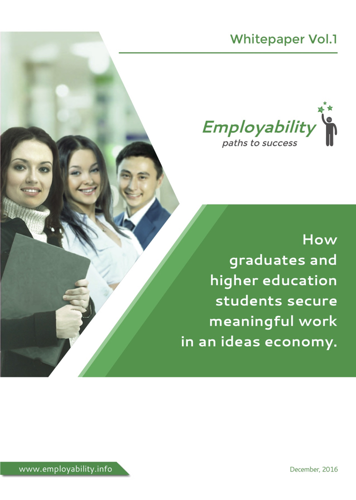


How graduates and higher education students secure meaningful work in an ideas economy.


**Starting work in a rapidly changing world involves having the right set of skills and attributes and a practical strategy.**

Being a graduate or having higher education is a good start to securing meaningful work. Having relevant job search skills and attributes to successfully navigate the labour market landscape and prepare for a career in an ever-changing economy is the real key to landing, and excelling in meaningful work.

In 2012, the uncapping of Commonwealth funded university student places fundamentally unleashed a student demand-driven higher education system. This shift is one factor influencing the considerable challenges in labour market outcomes for individuals from various equity groups especially graduates from non-English speaking backgrounds and female graduates from science, technology, engineering and mathematics, or STEM, fields of study.

This white paper outlines key issues impacting graduates and higher education students when transitioning into the labour market. The paper specifically:

- Explores factors impacting graduates’ and higher education students’ entry into the labour market
- Offers particular insights for graduates in key equity groups who face labour market disadvantage, and
- Provides a blueprint for graduates and higher education students to secure meaningful work.

**I was the editor for this white paper.**

