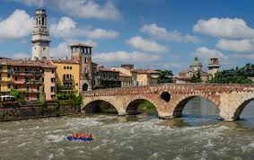
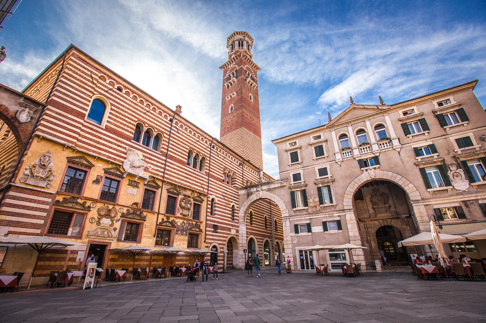
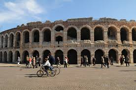
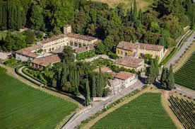
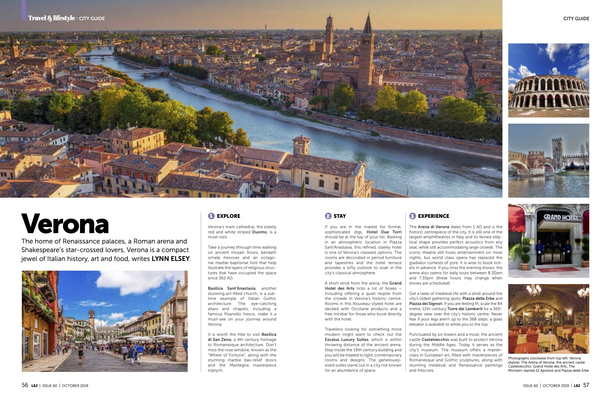

**Verona City Guide**

The home of medieval and Renaissance palaces, a Roman arena and Shakespeare’s star-crossed lovers, Verona is a compact jewel of Italian history, art and food.

STAY

If you are in the market for formal, sophisticated digs, **Hotel Due Torri** should be on the top of your list. Basking in an atmospheric location in Piazza Sant’Anastasia, this palace-based hotel is one of Verona’s top-shelf options. Along with rooms decorated in period furniture and tapestries, the hotel’s terrace is an inviting place to soak up the city’s classical atmosphere, day or night.

A short stroll from the arena, the [**<u>Grand Hotel des Arts</u>**](https://www.grandhotel.vr.it/)ticks a lot of boxes – including offering a quiet respite from the crowds in Verona’s historic centre. Rooms in the art-flavoured hotel come equipped with Occitane products and a free minibar for those who book directly with the hotel.

Travellers looking for something more modern might want to check out the [**<u>Escalus Luxury Suites</u>**](https://www.escalusverona.com/), which is within shouting distance of the ancient arena. Inside the 19th century building, guests are treated to light, contemporary rooms and designs. The generously-sized suites come well equipped, including bathrobes, slippers and coffee machines.

EXPLORE

Verona’s main cathedral, the stately red and white striped [**<u>Duomo</u>**](https://www.chieseverona.it/en/), offers a journey through time, with ancient mosaic floors, ornate frescoes and an octagonal marble baptismal font that help illustrate the many layers of religious structures that have occupied the space since 362 AD.

[**<u>Basilica Sant’Anastasia</u>**](https://www.chieseverona.it/en/)**,** another stunning art-filled church, is a sublime example of Italian gothic architecture. The eye-catching decorated altars and chapels, including a famous Pisanello fresco, make it a must-see on your journey around Verona.

It is worth the hike to visit [**<u>Basilica di San Zeno</u>**](https://www.chieseverona.it/en/), a 4th century homage to Romanesque architecture. Don’t miss the rose window, known as the “Wheel of Fortune”, along with the stunning marble bas-relief doors and the Mantegna masterpiece triptych.

EXPERIENCE

Verona’s [**<u>Roman arena</u>**](https://www.arena.it/), dating from 1 AD, is the historic centrepiece to the city. One of the largest amphitheatres in Italy, its elliptical shape means it provides perfect acoustics from any seat while allowing it to accommodate a large number of spectators. Verona’s signature icon is still is in operation, although world class opera has replaced the gladiator contests of yore. It is wise to book ahead for tickets. The arena is open for tours daily.

Get a taste of medieval life with a stroll around **Piazza delle Erbe** and **Piazza dei Signori,** the city’s oldest gathering spots. If you are feeling fit, scale the 84 metre, 12th-century **Torre dei Lamberti** for a 360-degree view over the city’s historic centre. If your legs aren’t up to the 368 steps, a glass elevator can whisk you to the top.

Punctuated by six towers and a moat, the ancient castle [**<u>Castelvecchio</u>**](https://museodicastelvecchio.comune.verona.it/nqcontent.cfm?a_id=42545) was built to protect Verona during the Middle Ages. Today it serves as the city’s museum. Filled with ancient arts and masterpieces of Romanesque and gothic sculptures, along with stunning medieval and Renaissance paintings and frescoes, the museum offers a masterclass in European art.

DRINK

**Osteria del Bugiardo** on Corso Porta Borsari is a popular bar and café, providing food and drink throughout the day and evening. Sample some of the region’s wines, including those from the owner’s Valpolicella vineyard, along with other drinks and traditional local dishes.

For something a little lighter and more local, visit **Scapin Caffe Cucina Bottega**. With a multi-page list of wines, bubbles and beers by the glass, this modern wine bar is a great place to try out an array of Italian tipples and yummy snacks.

EAT

One of the city’s most romantic places to eat, [**<u>Ristorante Ponte Pietra</u>**](https://ristorantepontepietra.it/)**,** serves up excellent regional cuisine in a series of charming rooms. The restaurant’s two terraces, overlooking the Adige river and the historic Ponte Pietra, provide a perfect setting for a candlelight dinner.

The Michelin-starred [**<u>12 Apostoli</u>**](https://www.12apostoli.com/en) is one of Verona’s oldest and most extraordinary places to dine. From the historic frescoes and excavated ruins that provide a unique aura to the personal greetings from the chef and gourmet offering, it lives up to its reputation as a temple for food.

**De Rossi** has been providing Verona aficionados with delicious breads, pastries and snack, since 1947. Don’t leave without a bag of the Baci di Romeo and Giulietta biscotti, e.g., Romeo and Juliet kisses.

SHOP

Verona’s two main shopping streets, Via Mazzini and Corso Porta Borsari, will fulfil the dreams of the most confirmed fashionistas – along with providing a nice dent in your pocketbook or wallet.

If wine is your thing, don’t miss [<u>Winefriends</u>](https://www.winefriends.it/it/), where you can find an amazing array of interesting wines from all over Italy, many from smaller wineries. Store owners Lia and Marco are happy to provide useful information and suggestions about each of the wines.

OUT OF TOWN

**Valpolicella**

Valpolicella, one of Italy’s most respected wine regions, lies less than a half hour’s drive from Verona. Most of the wineries offer tours and tastings, which luckily usually include a sampling of the area’s sumptuous red masterpiece – Amarone. The historic Masi winery and estate **Serego Alighieri**, which originally was the home of Dante’s son, has a suite of self-catering apartments tucked away in the lovely villa, which make an excellent base for extended wine tasting or as an escape from the heat of the Italian sun.

**Lake Garda**

A day or weekend getaway to Lake Garda is a favourite with Verona locals, especially during the summer months. As Italy’s largest lake, it is also a big draw for European vacationers.

With pastel villas and rolling green hills as background decor, the shores of the lake are dotted with more than 20 picturesque villages. Boating, swimming, hiking or relaxing in a waterside trattoria are all great ways to enjoy the lake, which is less than an hour from Verona.

*This article originally appeared in the LSJ, October 2019.*

 
