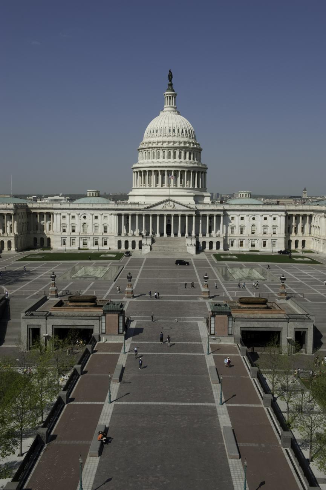

*America’s capital truly has something for everyone, from history boffins and wannabe spies to wine connoisseurs. LYNN ELSEY checks out the action inside the Beltway.*

**TO DO**

Guided tours of the [<u>US Capitol</u>](http://www.visitthecapitol.gov/) are open to the public and advance reservations are recommended. The Senate and House galleries, which are not included on the tour, are open to visits when in session. Australians can enquire about getting a pass at the appointment desk in the visitor centre.

Just across the Potomac River from the Mall, American’s top military cemetery, [<u>Arlington National Cemetery</u>](https://www.arlingtoncemetery.mil/#/), was created to honour those who had served the country. The formal and informal gardens and extensive grounds provides a scenic, peaceful and poignant reminder of the impact of military service. Key sights include the Tomb of the Unknown Soldier, which is guarded 24/7 by special sentinels – don’t miss the hourly (or half-hourly in the summer) changing of the guard – and President Kennedy’s grave.

Fancy being a spy for a day? The [<u>International Spy Museum’s</u>](https://www.spymuseum.org/) mission is to educate the public about espionage and intelligence work in an engaging, fun way. The museum, which is run by a former counterintelligence specialist, provides special tools and insight into the work of spies and secret agents. Anyone hankering to try out a bit of spy action will want to check out the museum’s “Spy in the City” activity, which involves using a set of clues, codes and intercepts to complete a secret mission somewhere in the city.

**THE MONUMENTS**

DC is awash in monuments and you can experience many of them for free. Luckily, most are centrally located and large enough in stature that you won’t need a map to find them.

At just under 170 meters, the Washington Monument dominates the DC skyline. The obelisk was erected in 1884 in honour of the country’s first president. Tickets can be purchased in advance or on the same day, when numbers allow.

The Jefferson Memorial, which was inspired by the Pantheon in Rome, is another must-see. An imposing bronze statue of President Jefferson holds court over the grand marble rotunda, surrounded by inscriptions of some of his most famous words including the Declaration of Independence. The memorial’s location, on the banks of the Tidal Basin and a picturesque cherry tree-lined walkway, ensure that the memorial appears in many films and TV shows.

Along the western end of the National Mall, the Lincoln Memorial towers over the Reflecting Pool. Inspired by ancient Greek temples, 36 columns represent each state at the time of President Lincoln’s death. The words to the Gettysburg Address, one of Lincoln’s most famous speeches, is etched into the walls.

The remarkably simple but extraordinarily moving Vietnam Veterans Memorial is a stark reminder of the ravages of war. The dark granite walls are etched with the names of the 58,286 servicemen who were killed or went missing during the Vietnam War. The memorial was created by architect Maya Lin, who won a contest to design the memorial while still in university.

**THE SMITHSONIAN**

The S[<u>mithsonian,</u>](https://www.si.edu/) the world’s largest museum, education and research institute, dominates the National Mall in the heart of DC, with eleven museums and galleries, along with six other locations around the greater DC area. The galleries and museums, which are all free, also offer an array of lectures, concerts and films.

The Freer Gallery of Art and Arthur M. Sackler Gallery focus on art, including an Asian art collection with Chinese jades and bronzes and textiles, an extensive James McNeill Whistler collection and other famous American artists including Winslow Homer and Georgia O’Keeffe along with European masters. The striking, round Hirshhorn building features modern and contemporary art including works by Henry Moore, Jeff Koons and Rodin sculptures along with cutting- edge films. Visitors are encouraged to whisper their wishes to the branches of Yoko Ono’s “Wish Tree for Washington DC”; in the summer months the tree “blooms” with hand-scribed wishes from visitors.

As home to the world’s largest natural history collection, it’s no surprise that the Natural History Museum is enormous, including the ever-popular dinosaur displays, the Hope Diamond and Egyptian mummies. The African American Museum, the Smithsonian’s newest, documents African American life, art, history, and culture. Highlights include artefacts from America’s shameful era of slavery and civil rights fight to more recent cultural items, including a jacket and fedora worn by Michael Jackson.

The Air and Space Museum is home to the 1903 Wright Brothers plane and a lunar module along with acres of aviation and space related- memorabilia. It also offers hands-on activities, a planetarium and screenings of IMAX films on its five-storey-high screen.

A short drive or trip on the city’s metro system takes you to the 65-hectare National Zoo, home to more than 1,500 animals, including the ever- popular giant pandas, Sumatran tigers and Asian elephants.

<u>GET OUT</u>

Capitol Hill, adjacent to the stately building, is a popular place to live and play, complete with many renovated 19th century row houses. Eastern Market, a destination for fresh food, arts and crafts and events, has long been a weekend favourite for DC residents from all corners of the district.

Home to students, politicians, West Wing staffers and diplomats, **Georgetown** is always abuzz with activity. The area’s cobblestone streets and trendy shops, bars and restaurants further add to the fun. Ever-trendy Dean & Deluca gourmet store/eatery epitomises the neighbourhood and includes an ever-popular café, bakery and charcuterie. Stroll through the grounds of Georgetown University to get a taste of the next decade’s high-profile lawyers, politicians and global heads of state.

Stretching more than 184 miles from Georgetown to Cumberland, Maryland, the Chesapeake and Ohio Canal, locally known as the **P&O Canal,** is a great way to explore the DC environs, whether by foot, bike or from a horse-drawn canal boat.

**STAY**

For a bit of old world style and service, look no further than the [Jefferson Hotel](https://www.jeffersondc.com/?gclid=EAIaIQobChMIxdLZhuv94AIVVRmPCh1XlwSrEAAYASAAEgKwPPD_BwE&gclsrc=aw.ds). The historic boutique hotel adds a touch of elegance to any visit, from marble fireplaces and wood panelling to discrete, perfect service. Book lovers will relish the hotel’s First Library program, which sponsors a book for every room reservation toward the DC Public Library’s “Books from Birth” program, which sends DC children a book each month to keep, from birth until they turn five; foodies will enjoy the hotel’s Michelin-starred restaurant, Plume.

The [Willard Intercontinental Hotel](https://washington.intercontinental.com/) definitely has a presidential flair, from the red carpets and marble pillars to the shiny chandeliers. Its location, along Pennsylvania Avenue near the White House, and its grand lobby ensure that the hotel remains a favourite with politicians and well-heeled tourists alike.

**DRINK**

[**<u>Quill’s</u>**](https://www.jeffersondc.com/)private club atmosphere ensures that this somewhat hidden bar and lounge is a popular place for lawyers, especially in early evening during the week. Along with an amusing list of cocktails – East Coast Filly, Roman Rondabout – wine lovers are in safe hands with the bar staff, who can recommend a sumptuous glass or two. The bar also serves snacks and light meals, often to the backdrop of live piano music. Quill is in the Jefferson Hotel.

Locally known as one of the district’s best places to “be seen and not hear”, [**<u>Off the Record</u>**](https://www.hayadams.com/), in the rather posh Hay-Adams Hotel, leaves no doubt about the area’s link to politics. Along with caricatures of the city's political elite lining the walls, the bar offers collectible drink coasters, including Angela Merkel and everyone’s favourite Supreme Court Justice – Ruth Bader Ginsburg. It also offers an array of wines and food.

**EAT**

Fishers Farmers Bakers offers eco-chic on the Georgetown waterfront. Its eclectic menu is based around the restaurant’s sustainable, grower-to-table experience that appears to be the trend du jour in DC these days. The restaurant’s eco credentials extend to the fixtures and fittings, which are heavy on the reclaimed or recycled scale.

Michelin-starred Fiola’s restaurant’s reputation and location ensure it regularly appears on many “Best DC Restaurant” lists. Bargain hunters will find their weekday 3-course Maria Menu lunch menu a steal at $28; lovers of Italian wines will be happy at any time of the day or night.

Le Diplomat, another popular DC haunt, is also the setting for the occasional State Department security service training exercise for new agents, which can add an extra slice of interest to a meal at the French café.

**OUT OF TOWN**

Annapolis, Maryland, a charming colonial seaport town, which is the home of the US Naval Academy and the state’s capital. The Maryland State House is open to the public and offers free self-guided tour information. The town’s cobblestone lanes are full of cute antique shops, galleries and restaurants. If you hanker an adventure on water, kayaks and canoes can be hired at Annapolis Canoe and Kayak. The city’s famed [<u>Annapolis Sailing School</u>](https://www.annapolissailing.com/) hires out sailboats to qualified sailors. Non-sailors can enjoy one of their Evening Sails.

For a taste of the South and a peak into the creative mind of one of America’s most revered presidents, head to [<u>Monticello</u>](https://www.monticello.org/). Thomas Jefferson’s stately plantation, in the bucolic Virginia countryside, is considered one of Jefferson’s masterpieces, including a stately villa that he designed based on Italian Renaissance designs, along with gardens that showcase some of Jefferson’s interest in experimental horticulture. Tours also highlight the legacy of slavery during his time.

While you are in the area, a visit to nearby Charlottesville might be of interest. Until recently the town was best known for its prestigious university but now is more often remembered as the scene of distressing racial strife in August 2017 – showcasing America at its worst.

 

**Originally published in the September 2018 edition of the** [**NSW Law Society Journal**](https://lawsociety.cld.bz/LSJ-September-2018/58/)**.**



