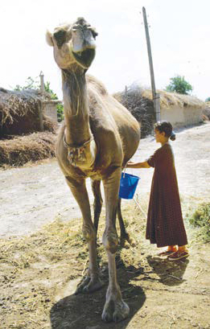

Camel milk has played an important role in the diet of nomadic and pastoral cultures for centuries. Because it is highly transportable, convenient and a low-energy source of sustenance – nomads can live for up to a month on nothing but camel milk – it is an ideal alternative to cow’s milk in the arid regions of the world.

Along with its practical assets, camel milk has been identified as having significant health benefits including being high in iron, having three times the vitamin C as cow’s milk, rich in B vitamins, high in protein and low in fat and cholesterol. It also may be suitable for those who are lactose intolerant.

The Food and Agriculture Organization of the UN (FAO) is a big fan. The organisation has found that “there is a growing recognition of the value and benefits of camels for their milk, meat and fibres”.

However, because camel milk has a different protein composition to cow milk, attempts to make cheese from it haven’t been successful.

“Camel milk is very difficult to coagulate because of its low levels of k-casein, the protein that makes the milk coagulate,” said Rolando Saltini, a Chr Hansen product manager. Use of bovine, microbial or vegetable coagulants result in either weak curd formation or a complete absence of clotting.

However, the company has developed a new ingredient that could have far-reaching impact on the nomadic community. Far-M is pure camel chymosin produced by fermentation. Designed for both cow and camel milk processing, it allows production of firmer camel cheese. Also, production yields are comparable to those from cow’s milk cheese. It comes in a liquid and highly stable powder, making it suitable for transporting at ambient temperatures and to rural areas.

“Since we are the only company producing camel chymosin by fermentation – the only coagulant that allows production of camel cheese – we feel that we have the obligation to support the development of this industry,” Saltini said.

As a result, Chr Hansen has teamed up with a Kenyan company, Oleleshwa Enterprises, to improve the conditions of small-scale camel owners in Kenya and Somalia. By developing basic knowledge about camel cheese production, the project aims to enable camel owners to produce camel cheese for sale as well as their own consumption.

The project also involves developing rural and industrial camel cheese recipes which will be provided to the African and Middle Eastern camel community free of charge, evaluating the taste of the cheese and developing production manuals.

Initial results have been positive.

Anne Bruntse, the director of Oleleshwa Enterprises, has reported that trial samples had resulted in cheese that tasted better, had a better consistency and made the cheese-making process easier.

“If successful, this project could potentially improve the livelihood of thousands of rural inhabitants in Northern and Eastern Africa,” said Henriette Oellgaard, CSR Manager, Chr Hansen. She said that the project might also lead the way for future commercialisation of Far-M.

 

This article was originally published in Food Australia Magazine, the journal of the [Australian Institute of Food Science and Technology](https://www.aifst.asn.au/). Click below for the original copy.



