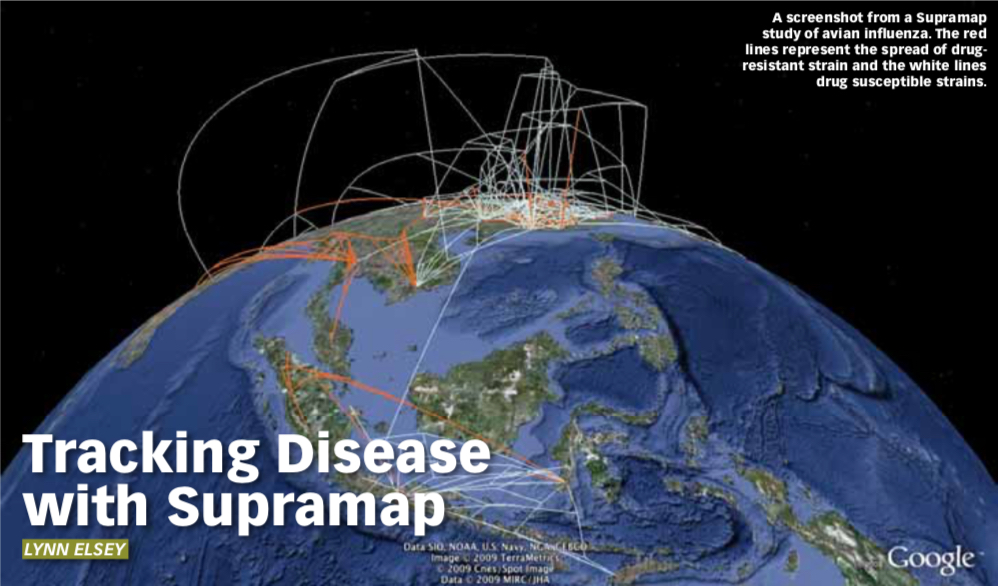

A new web-based program is providing an innovative tool to track the spread of infectious diseases across time, geography and humans. Supramap, a supercomputer powered system designed by scientists in biomedical informatics at The Ohio State University in the US uses GIS to calculate and project evolutionary information.

The results have been called “weather maps for disease”. They provide a visual representation of when and where pathogens spread, how they jump from animals to humans, and evolve to resist drugs.

“The Supramap tool set has broad utility not only in tracking human disease in time and space, but historical patterns of biodiversity and global biotic changes,” said Ward Wheeler, who is curator-in-charge of scientific computing at the American Museum of Natural History.

Wheeler is working on the Supramap project with a team of researchers headed by Daniel Janies, a biomedical informatics researcher at OSU. “Currently, we are investigating H1N1 cases from around the world – and Ohio – by building evolutionary trees to discover how this strain came to be assembled and jumped from animals to humans,” Janies said. “We are also monitoring specific viral genes for mutations that confer resistance to drugs.”

The project was originally designed to track the avian influenza virus. According to a paper published in the journal Cladistics, the program has already led to a link between a genetic mutation in the avian flu, to the virus jumping from birds into mammals.

The aim of the project is to receive a steady stream of genomic and geographic data on viruses from around the world. The data will be analysed nightly with updated maps available the following morning.

Janies said that this would allow policymakers to make better decisions on critical issues. It will help determine global hotspots for the emergence of dangerous pathogens and identify where antiviral drugs would be most useful.

The researchers say that the program’s pathogen-tracking abilities could be used for a variety of purposes, including medical and natural history research, public health and national security decisions. They will also be valuable for tracking changes in animal or plant populations.

“The goal is to provide a common framework for testing ideas on how complex interactions of animals, humans and the environment lead to the emergence of diseases,” Janies said.

The GIS underlay allows a disease’s spread to be plotted on a Google Earth map. This data can be layered with other information – population, climate, transportation and animal migration patterns – which helps illustrate the spread and possible new paths of the disease.

According to Janies, presenting data in Supramap’s visually attractive format will enable researchers to better hypothesise about the spread of disease, and allow them to communicate their findings in a non-technical way.

"We package the tools in an easy-to-use web-based application, so you don't need a PhD in evolutionary biology and computer science to understand the trajectory and transmission of a disease," Janies said.

The team is currently completing the development of a web interface that will provide easy access to the application by other scientists and public health officials.

 

This article was originally published in the June/July issue of [Position Magazine](https://www.spatialsource.com.au/magazine). Click below for the original copy.



