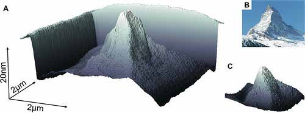
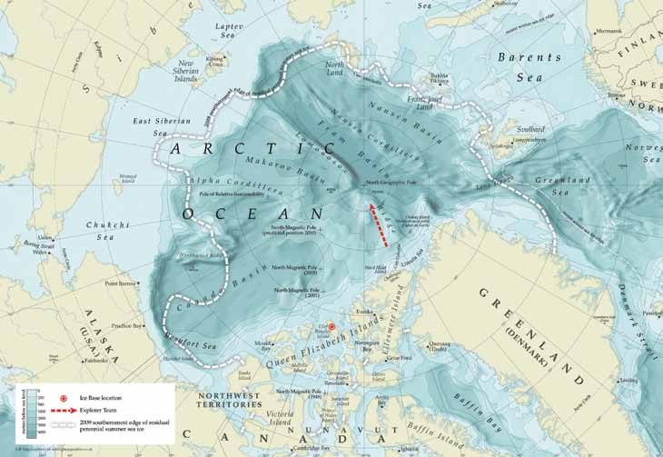
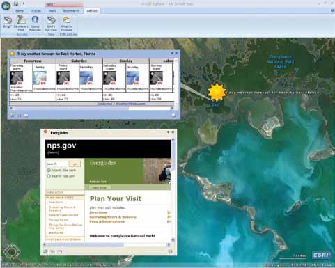
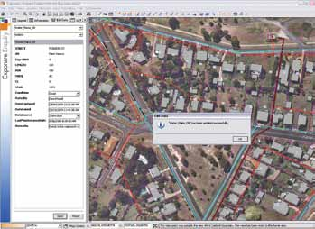
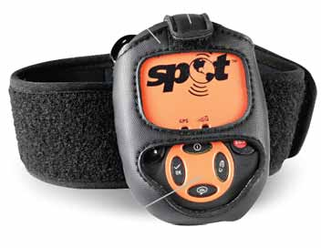
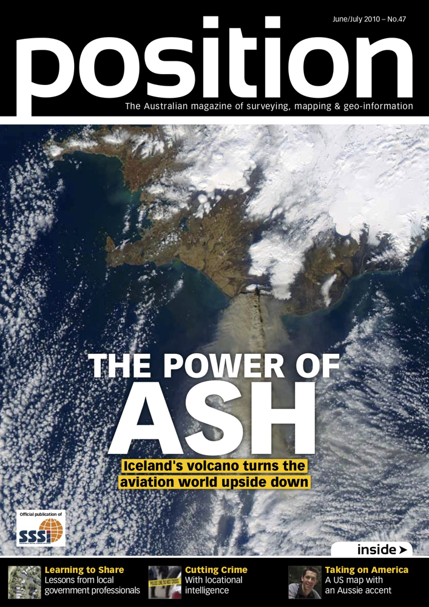

*As editor of Position magazine and spatialsource.com I provided an array of geo-spatial content including GPS, satellite, technology, mapping and other spatial information.*

**A Critical shortage**

The demand for geospatial technology professionals is expanding at a much greater rate than the supply, says Chris Rizos. The head of the University of New South Wales School of Surveying and Spatial Information Systems raised the subject during the International Federation of Surveyors Congress in Sydney.

Rizos said that the rapid growth in geo-related fields such as satellites, 3D imaging and GPS, and in ever broadening areas such as environmental monitoring and climate change, was driving a growing demand for skilled professionals.

Unfortunately, he said, the pool of such professionals is dangerously low. Also, the potential source of new professionals, students, is under resourced.

Rizos raised the much discussed scenario of aging demographics in the surveying industry. Currently only 20 per cent of those working in the profession are in their 20s he said.

“Technology has revolutionised the world of surveying and spatial information in general, but we can no longer meet the needs of industry and government.”

**Responding to Haiti**

Web 2.0 technologies will drive the future of geospatial technology for disaster mapping and emergency response. The observation was made by ESRI’s Brent Jones at the International Federation of Surveyors (FIG) Congress in Sydney in April.

Jones and his team worked with numerous disaster response organisations in the aftermath of the Haitian earthquake in January. The situation in Haiti clearly demonstrates the immense power and importance of volunteered geographic information, said Jones.

This citizen-sourced information – mobilised via a plethora of Web 2.0 technologies – is changing the way that governments and professionals use information in emergency situations.

User-generated content played a critical role in relief efforts in Haiti, he said. For example, OpenStreetMap users armed with little more than mobile phones were among those collecting intelligence in the immediate aftermath of the earthquake.

Another example is the ‘Text Haiti’ campaign, which managed to raise $396 million in only two days using a text-based donation system. Twitter and Facebook were also important components of the response, according to Jones.

“All this data is being integrated in a Web 2.0 environment and is really changing the way we respond.”

The challenge for GIS professionals is how to extract accurate geospatial data from this storm of information. Importantly, many of these tools are being made freely available to non-GIS professionals.

“What we’re seeing is two worlds – professional and consumer – coming together. This is how we’re going to respond to the next disaster. Everyone’s going to be able to mash one of these things together with what they want, using these rich base maps.”

Mobilising citizen knowledge by making data freely available to all means that the collective pool of intelligence becomes increasingly sophisticated, and yet it is simpler to use, Jones said. Because the data has been modeled, with symbology already in place, undertaking rich analysis via the web can be done quickly.

**Remote Sensing Keeps Expanding**

The global civil and commercial remote sensing satellite market will be worth $16 billion by 2019, according to projections by US market intelligence firm Forecast International. Over the coming decade, it says, more than 100 individual remote sensing satellites will be launched.

The projections are contained in a report titled The Market for Civil and Commercial Remote Sensing Satellites, which covers 48 satellite production programs.

Government and military agencies continue to be the most important consumers of satellite imagery, according to the report. The revenue generated from contracts with the US National Geospatial-Intelligence Agency’s NextView program has allowed both GeoEye and DigitalGlobe to upgrade their fleets and provide better value for both government and private clients.

The report also notes that privately operated satellite companies are increasingly

in competition with public - private partnerships to develop and operate satellite fleets.

It adds that many programs around the world –  such as the Indian Cartosat, Canadian Radarsat and Franco-Italian COSMO- SkyMed/Pleiades – blur the distinction between government and privately operated networks.

**World’s Smallest 3D Map**

IBM scientists have created the smallest 3D map of the Earth. How small is it? So small that 1,000 such maps could fit on a grain of salt.

The scientists used a new technique involving a tiny silicon tip with a sharp apex – one million times smaller than an ant – to create tiny patterns and structures, and at greatly reduced cost and complexity.

Along with creating a way to make headlines, and really small maps, the project’s

technology could lead to improvements in the development of nanoscale structures and devices. For example, it could be applied in future chip technology, medicine and opto-electronics.

The IBM team created several 3D and 2D patterns to demonstrate the groundbreaking techniques and capabilities of the project. These include a 25-nanometer-high 3D replica of Switzerland’s Matterhorn, made out of molecular glass, representing a scale of 1:5 billion.

The new technique achieves resolutions as high as 15 nanometers, and has a potential of going even smaller. The nanotip tool, which can sit on a tabletop, promises improved and extended capabilities at very high resolutions, but at one fifth to one tenth of the cost.

**Acid in the Arctic**

An expedition has set out from northern Canada to investigate the potential effects of carbon dioxide on the Arctic Ocean.

The Catlin Arctic Survey 2010 is undertaking research into the impact of greenhouse gases on the marine life of the Arctic Ocean. The researchers will make the 777 kilometre hike to the pole, collecting water and marine life samples from beneath the ice.

Lead explorer Ann Daniels and two other scientists will investigate the rate of acidification of the Arctic and its effect on wildlife. Scientists believe that declining thickness is one of the reasons for the sudden disappearance of summer ice in the Arctic. The studies also include the impact of rising CO2 on some species. For example, increasing acidification of the oceans makes it more difficult for marine animals to form shells and bones.

Catlin Group Limited, an international specialist property and casualty insurer and re-insurer based in London,is sponsoring the expedition. MDA Information Systems in Vancouver is providing information on ice state from its Radarsat-2 satellite. MDA will correlate the data collected from the expedition with the imagery to determine the ability of the radar technology to measure the thickness of the ice.

A new web-based program is providing an innovative tool to track the spread of infectious diseases across time, geography and humans. Supramap, a supercomputer powered system designed by scientists in biomedical informatics at The Ohio State University in the US uses GIS to calculate and project evolutionary information.

The results have been called “weather maps for disease”. They provide a visual representation of when and where pathogens spread, how they jump from animals to humans, and evolve to resist drugs.

“The Supramap tool set has broad utility not only in tracking human disease in time and space, but historical patterns of biodiversity and global biotic changes,” said Ward Wheeler, who is curator-in-charge of scientific computing at the American Museum of Natural History.

Wheeler is working on the Supramap project with a team of researchers headed by Daniel Janies, a biomedical informatics researcher at OSU. “Currently, we are investigating H1N1 cases from around the world – and Ohio – by building evolutionary trees to discover how this strain came to be assembled and jumped from animals to humans,” Janies said. “We are also monitoring specific viral genes for mutations that confer resistance to drugs.”

The project was originally designed to track the avian influenza virus. According to a paper published in the journal Cladistics, the program has already led to a link between a genetic mutation in the avian flu, to the virus jumping from birds into mammals.

The aim of the project is to receive a steady stream of genomic and geographic data on viruses from around the world. The data will be analysed nightly with updated maps available the following morning.

Janies said that this would allow policymakers to make better decisions on critical issues. It will help determine global hotspots for the emergence of dangerous pathogens and identify where antiviral drugs would be most useful.

The researchers say that the program’s pathogen - tracking abilities could be used for a variety of purposes, including medical and natural history research, public health and national security decisions. They will also be valuable for tracking changes in animal or plant populations.

“The goal is to provide a common framework for testing ideas on how complex interactions of animals, humans and the environment lead to the emergence of diseases,” Janies said.

The GIS underlay allows a disease’s spread to be plotted on a Google Earth map. This data can be layered with other information – population, climate, transportation and animal migration patterns – which helps illustrate the spread and possible new paths of the disease.

According to Janies, presenting data in Supramap’s visually attractive format will enable researchers to better hypothesise about the spread of disease, and allow them to communicate their findings in a non-technical way.

"We package the tools in an easy-to-use web-based application, so you don't need a PhD in evolutionary biology and computer science to understand the trajectory and transmission of a disease," Janies said.

The team is currently completing the development of a web interface that will provide easy access to the application by other scientists and public health officials.

**ArcGIS Explorer**

The new version ArcGIS Explorer improves the user interface and expands the maps available online. It features a new analysis gallery with advanced tools that allow a direct connection to geoprocessing services.

The basemap gallery has also been updated. It offers new ArcGIS online imagery and topographic and street maps. It also includes the new Manage My Basemaps option, which allows users to add or remove maps from the gallery or change the image associated with each base map.

The new release also supports enhanced layer package properties and the ability to fly along user defined paths. Bing Maps services have been built into ArcGIS Explorer to provide access to worldwide aerial and space-based imagery. Visit www.esri.com/arcgisexplorer for more information.

**Exponare 4.0**

Pitney Bowes Business Insight has released the latest version of its web mapping product, Exponare. In version 4.0, users can edit attribute data within the program, enabling them to maintain their own data without the need for a desktop power tool.

Other new features include the ability to open a layer and add it to any current work context. This allows users to access more data without administrator intervention, including opening additional layers when required.

Version 4.0 also has redlining capabilities that allow objects to be drawn, moved, deleted, saved and recalled. Users can save the annotations into MapInfo Professional. Visit www.pbinsight.com.au/products/location-intelligence/applications/mapping-analytical/exponare/ for more information.

**Leica Freebird**

Leica has released the new IPAS Freebird. The inertial positioning and attitude system is designed to be integrated into sensor systems to enable geo-referencing.

The new version no longer requires a continuous lock on navigation satellites. It frees up mission planning by allowing much tighter turns between flight lines, with up to 25 per cent improvement in flight economy for aerial survey missions, according to the company. It also delivers a time saving of several minutes per turn.

Previously, GNSS-IMU processing required separate steps for GNSS trajectory and IMU processing. The new product enables those steps to be combined using GNSS raw measurements and tightly coupled GNSS-IMU processing. Visit www.leica-geosystems.com/en/News_360.htm?id=2372 for more information.

**Earthworks**

Hemisphere GPS has released the Earthworks x200 excavator machine guidance system.

It is designed to improve operator accuracy and also simplify machine operations and reduce excavation rework. GPS and other precision sensors guide the operator.

The system is part of the company’s earthworks business unit that focuses on the design and manufacture of products for the construction market, including machine guidance and control of earth-moving machinery.

It can be used by operators of all skill levels, according to the manufacturer. Visit www.hemispheregps.com for more information.

**Mocal Now**

Yapp Mobile in Sydney has launched the Mocal application for the Apple iPhone. It duplicates the functions of a personal navigation device on Apple’s iPhone handset. The new product announces street names, supports 2D and 3D maps, offers a choice of day or night view, and works in both portrait and landscape display modes. The system will eventually go beyond street mapping functions, says yapp Mobile. The company says content providers such as TrueLocal, Eatability and Motormouth are already online. Visit www.mocal.com.au for more information.

**SPOT 2**

Johnny Appleseed has relaunched the Spot V2 Satellite Messenger which uses GPS and independent satellite communication to provide location information. According to the company the personal trackers have been used hundreds of rescue situations in numerous countries since their launch.

Features include an SOS button that broadcasts the user’s GPS location every five minutes. Another button sends a message to specified contacts – via phone and email – every five minutes for an hour.

Contacts can also be sent messages detailing the user’s condition and their location. Another function lets the user know that the unit is fully operational. Visit www.ja-gps.com.au for more information.

**Transport Software**

Navteq has released Navteq Transport, a digital map that includes truck-specific features to support truck and fleet management and navigation.

More than 20 attributes have been designed to encourage transport efficiencies. They include bridge heights and weight information, traffic signs, truck speed limits and preferred routes. These are available for most major Australian highways.

The mapping product also contains coverage of the Sydney, Brisbane, Melbourne, Canberra, Perth, and Adelaide metro areas with arterial and secondary roads. It can be used with other company products, such as 3D visual content and imagery. See www.navteq.com for more information.

 

**Click the image below for the original copy**.

 
