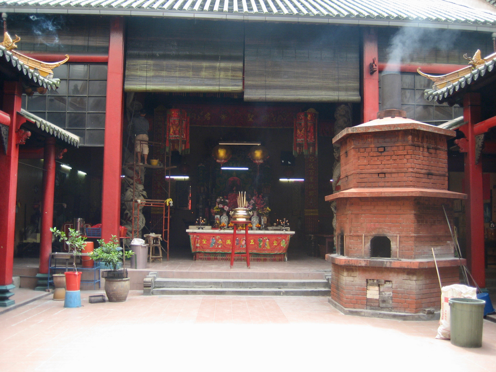

### Somewhere in KL

However, the main challenge for KL appears to be actually finding the station. Most are underground and I spend a fruitless few minutes walking up and down the street trying to find the one I’m looking for (KL City Centre). In hindsight, I should have remembered that KL is one of the shopping Mecca’s of Asia and of course the best way to get to it is via the monstrous shopping mall underneath the Petronas Towers. (I only discover this at the end of the day.)

During my repeated scampering across the highways trying to find the subway entrance, I’m distracted and amused by the walk signal for the pedestrian crossings In the good old days, you got a green guy when it was time to walk, and a red one when it was time best not to. Then the traffic engineers raised the ante by giving you a flashing red guy when it was time to get the hell off the road if you were still crossing. Some countries have gone a step further to give you a countdown timer, telling you exactly how long you have before you get run over. In KL, they’ve taken an amusing twist on this – the little green guy is an animated icon that walks when it’s time to walk, and when time is running out, he starts to run. Nice one.
