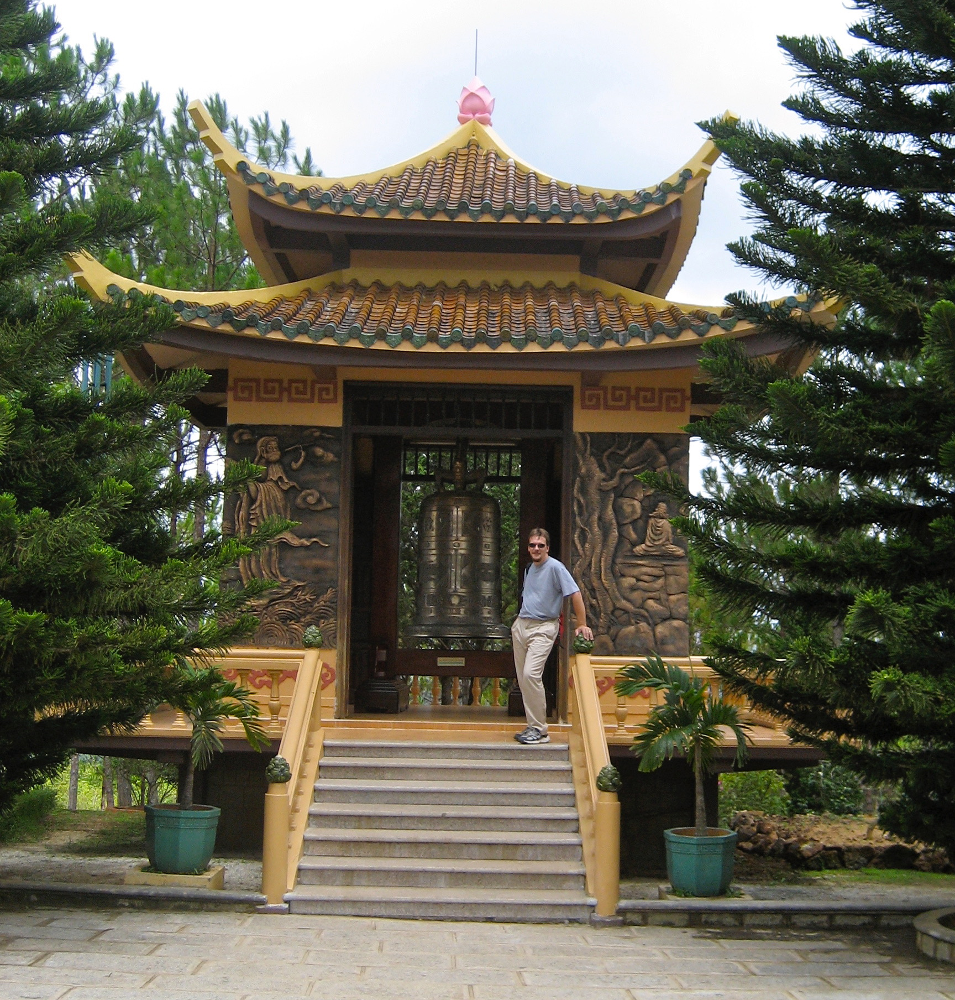
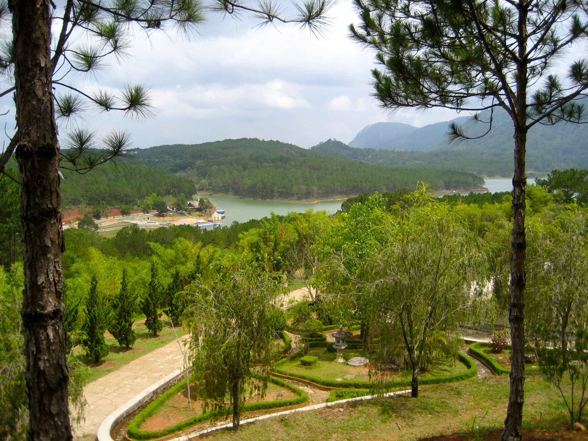

In the morning we jump on our moped and headed out to the Trac Lam Zen Monastery. Being up in the hills, Dalat is not only cooler but wetter than the coast, so we’re dodging the thunderclouds on the way out, hoping to stay dry.

The monastery is dedicated to the Truc Lam Ten Tu sect of Zen (quite the mouthful), which is a flavour of Zen that was founded over 900 years ago. In the interim, the monks have clearly been polishing up their monastery building and gardening skills in their spare time; both are absolutely magnificent. The buildings are immaculately kept and very serene, but the gardens take the prize. Everything is in perfect order and the colours and shapes are a joy to behold. The monastery is on the side of a hill that runs down to a large lake and the views across it to the hills beyond are enough to make you want to sign up and join the monks.

Dinner was back at Long Hoa where we were welcomed back like long lost friends.
