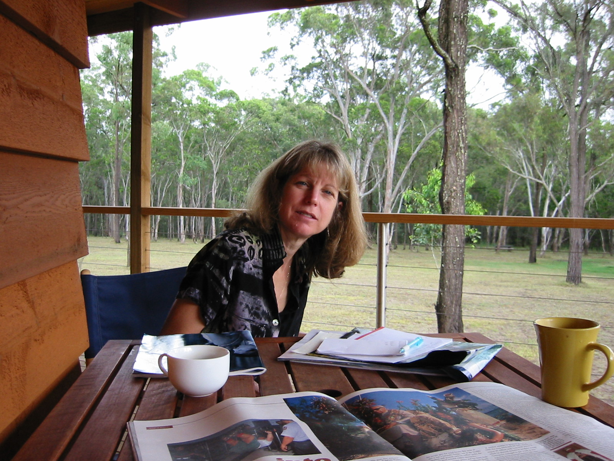
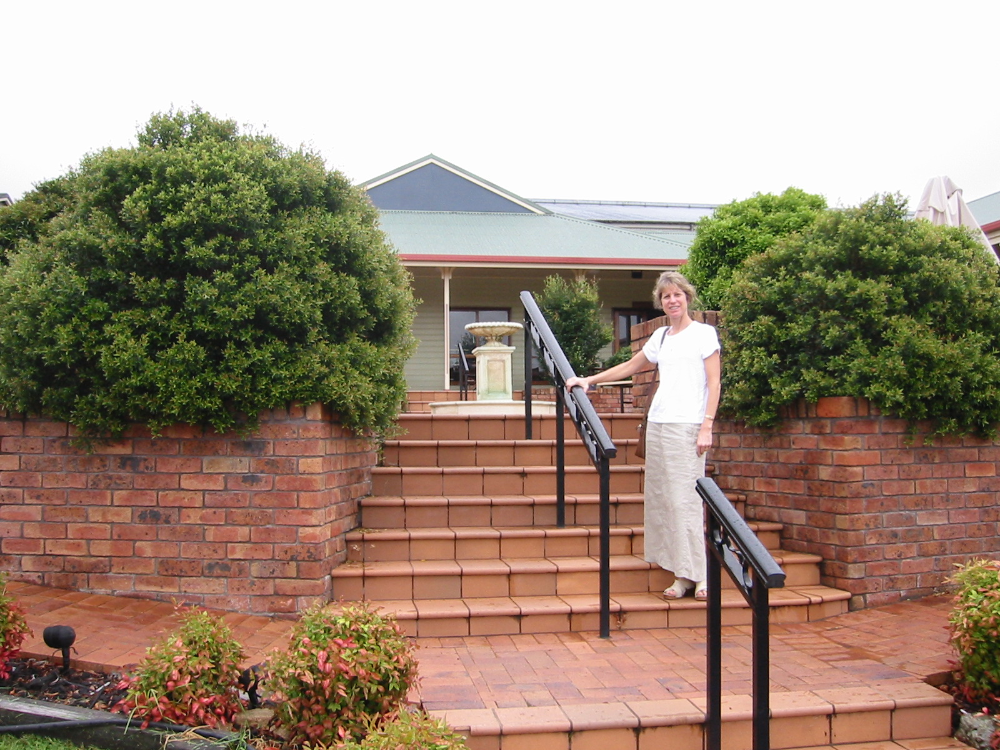
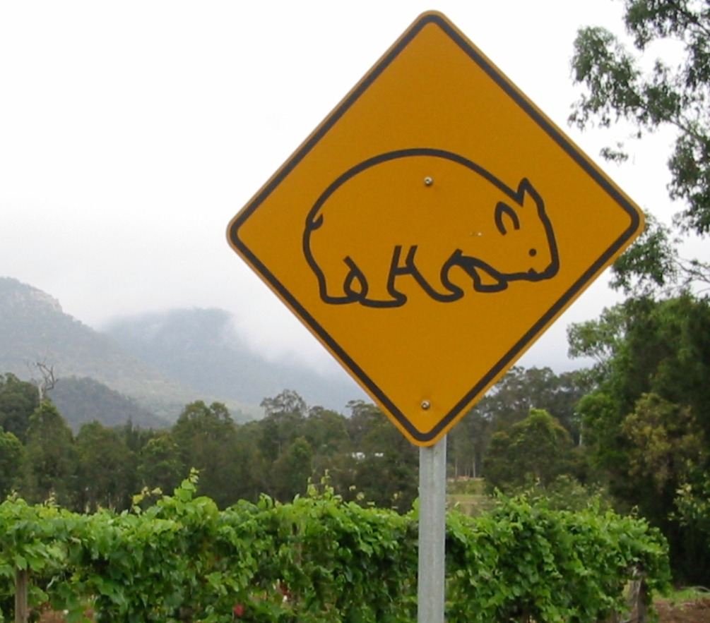

### 1 Feb 2002 - Driving to the Hunter Valley

Excitement is in the air! Today we wave a fond fair-well to Sydney and make a start on our travels. Unfortunately it's not an auspicious start. This morning it's raining...and I don't mean your mamby-pamby Oregonian type rain (I might just get quite wet if I stand out here for a few more minutes)...I mean real **R - A - I - N**! This is the tropical downpour variety, so heavy that you can barely see beyond the front of your car, even with the wipers going full speed. The roads are completely awash and the traffic is crawling as a result.

 

***Lynn writes...***

*If images of Mother England abound down under, influences from America are never far away. I lost count of the number of Starbuck’s in Sydney’s city center (their proliferation has been a surprising delight, and relief, to Nick). Tourist stores and wineries sell baseball caps along with tee shirts and key chains (although I have yet to see someone wearing a baseball cap). McDonald’s is everywhere. Sometimes with a twist. In a town called Wyoming, McDonald’s loos came equipped with black lights. Pretty cool if you are wearing a white tee shirt.*

 

Since we're heading north, we decide that we have to go over the Sydney Harbor bridge, rather than take the tunnel - we've been admiring this structure from afar for 4 years now (on and off), so we have to finally give it a whirl. Unfortunately, what with the rain and everything, the only view we are afforded from the top of the bridge is of the bridge itself. The rest of Sydney is lost in the hydro-haze.

God knows I'm all for public transport, but the occasional freeway / motorway would be nice. Unfortunately, these kinds of roads are pretty rare around Sydney (let alone the rest of the country), so it takes us a good hour to get out of the city.

 

***Nick on wine tasting...***
*I feel compelled to compare and contrast the wine tasting experience in Oregon and Australia.*

*Now over here, wine tasting is a fantastic experience. None of the wineries charge anything to taste, they pour generous samples and have a very large selection to choose from. Some of the larger wineries such as Mount Pleasant allow you to taste not only the locally cultivated stuff, but also wines from their other wineries around the country. Finally, the staff pouring the wines are unfailingly friendly, helpful and knowledgeable. Best of all, you can walk away with a really scrummy tasting bottle of wine for about US$7!*

*Now, back in Oregon, they had a great year for Pinot Noir sometime back, and ever since it's really gone to their heads. The wineries usually charge at least $5 to taste (and some up to $20), the pourings are microscopic and the selection usually limited. All this would be OK if the wines were gangbuster, but frankly, they're living off their past triumphs and today most of the wines are adequate in taste and vastly overpriced. On average, I would say that Oregonian wines of equivalent quality are easily 4 to 5 times as expensive as the Aussie offerings!*

 



We eventually break free of the city and head north on route 1. Just when we're finally getting some miles (sorry kilometers) behind us, we inadvisably decide to take to a 'scenic detour'. Maybe we're getting used to it, but we forget that it's still raining cats 'n dogs, so the scenery primary consists of bedraggled foliage, occasionally interspersed with bedraggled people.

We finally arrive at **Cessnock**, the town in the center of the wine district. After procuring a bed for the night at the [**Buffs Cottages**](http://home.primus.com.au/buffsresort/main.html) (yes, really), we head out into the countryside to sample some wines. Whoo hoo! The first things that strikes us about this region, compared to any other we've been to before, is the density of wineries per square mile. If you are super conscientious about drinking & driving (and/or really wanted to drink a lot), this would be perfect area to go wine tasting on a bicycle.

However, since we couldn't fit out mountain bikes in our suitcases, Lynn and I will just have to settle for former plan. We hit three wineries ([**Rothbury Estate**](http://www.beringerblass.com.au/brands/rothbury.asp), [**Mount Pleasant Estate**](http://www.mcwilliams.com.au/Wineries/tbc-wsummary.asp?qsvineyard_id=8) and **Tyrell's Vineyard**), drink conscientiously, have a great time chatting with the folks pouring the good stuff, and come away with some great bottles of wine.

We pick up some food for dinner and head back to the cottage - a delightful secluded place out in the bush. A bit of BBQ steak rounds off the day quite nicely (oh, and some catching up on some extra credit wine tasting didn't hurt too much either).

### 2 Feb 2002 - Staying in the Hunter Valley

As you can see from the picture above, Buffs Cottages back on to some rather tame and inviting looking bush, so I decide to go on a bit of a 'walk about' this morning. Turns out the owners have a few hundred acres of land to their name and I have a wonderful time traipsing through the trees, spying kangaroos and other unusual (at least for me) wildlife.

 

***Nick on road signs...***

*One of the more fun parts about driving around Australia is the road signs. For starters, you get the 'beware of the wildlife' type warning signs, but you're not really sure what it is you're supposed to be avoiding (and how big), such as the one shown here (it's a Wombat, just in case you were wondering).*

*Then you get the police warning signs. These guys needs to take a few lessons from the British in stealth tactics. Not only do they put up signs when the patrol cars are out and about, they tell you exactly what they're looking to nick to you - 'Police are targeting Seat Belts in this area' - for example.*

*Speed camera have made it to Australia, but they make it so easy to spot them that you'd literally have to be blind to get caught by one. They start a few miles out from the device with a couple of friendly warning signs - 'Warning, speed camera's in use in this area', but 200 yards before the actual camera they put 4 huge warning signs and 4 speed limit placards. When you get to this collection you know that you have to slow down to the speed limit for exactly 30 seconds, pass the camera and then speed up again!*

*Most amusing of all are the signs and billboards that fall into the category of 'do this and you're an idiot'. For example, they have some interesting ways of persuading you to wear a seatbelt, such as a picture of a smashed in car windshield with the caption 'No Belt, No Brains'. Certainly to the point.*

 

My only recommendation on doing this kind of walk is to try and avoid being the first person of the day to blaze the trail. The spiders over here have a tendency to spin huge webs across the trail, at head height, which the casual walker then stumbles blindly into. And the spiders are huge!

Revitalised and at one with nature again (or at least the smaller, creepy-crawly aspects of it), we head north for **Maitland**, not for any particular reason other than it's there. Once we get there and confirm that Maitland is indeed where it is supposed to be, we have a bit of a browse round the tourist information centre, come to the realisation that all the good wineries are back down south around Cessnock, and so promptly turn right around again!

We spend a relaxing lunch back at the Mount Pleasant winery, made all the more fun for sitting back and watching a couple of guys dismantle, repair and reassemble a fountain, only to realize that it was now all crooked and they had to do it all over again. Work is so much more fun when you can sit back and watch someone else do it!



We spend the afternoon rambling around a few more wineries and then check into the quaintly named [**Chez Vous**](http://www.winecountry.com.au/accommodation/chez%20vous/index.htm) cottages for the night. Our next door neighbour turns out to be a groom with an imminently appointment at the local church. And very nervous he sounded too (we had a bit of a gossip with the parents of the bride the next day and all went off OK apparently). But here's the cool part - even though we only spent an hour talking to these complete strangers, they were unbelievably friendly and helpful and ended up inviting us to come and stay at their home!

### 3 Feb 2002 - Staying in the Hunter Valley

Slow start this morning. We hit a couple of wineries and then have lunch at a Thai restaurant that's part of another winery. Interesting, even though they sell wines next door, the restaurant doesn't have a drink license.

The licensing laws over here make it somewhat harder for a restaurant to get an alcohol license, compared to the United States or the UK. But those that fail to make the grade (or can't be bothered to try) instead do '*BYO*' (Bring Your Own), which is a highly amicable arrangement, since you don't have to pay any markup to drink wine with your meal, and there's no corkage fee either.

This afternoon we head over to **Wollumbi**, a tiny little town with a population of no more than 250. The town boats the oldest church in Australia (built around 1840 by the local God fearing citizens). Interestingly, the local Inn / bar / hotel was constructed 17 years earlier by convict labor, so you can see where their priorities really were!



Tonight we stay at the **Cedar Creek Cottages** just outside Wollumbi, a very quaint little place actually on a local winery. The owners have a few hundred acres of land and farm three species of deer, in addition to various varieties of grape. We take a very pleasant stroll through the property, encountering 400 or so Bambi look a-likes.



The evening is finished over with a bit of wine consumption (of course!), doing battle with the BBQ and listening to the [laughing Kookaburra birds](http://www.elseyworld.com/kookaburra).

## 4 Feb 2002 - Driving to Melbourne

We wake to torrential rain and so decide to skip plans for a morning walk and instead head south towards **Melbourne**, the next big city on our itinerary. We had originally planned to make this a leisurely 3 day trip (it's about 750 miles) and make our first night stop in **Kangaroo Valley** - just 150 miles south of Sydney, but it's raining so hard that we decide to just go for it and get as far as we can, trying to out run the rain.



Therefore, this was one of the less exciting day of our journey so far - basically a road trip. We get about 600 miles and spend the night in a rather grim little motel in **Albury**. The highlight of the day was passing through the town of **Holbrook** (*the adopted home of the Australian Submarine Squadron*), which has apparently decided to honour the fact by planting a bloody enormous great big submarine in the town centre (the HMS Otway, if you care). For those of you not tracing this trip on your handy Australian road atlas, Holbrook is about 200 miles from the sea, so the question that begs to be answered is how on earth did they get it here (and why)? But, it was still raining, so your intrepid traveler couldn't be bothered to get out of the car to find out!

Tomorrow we have a short trip to reach Melbourne, which means a new chapter in this journal.
