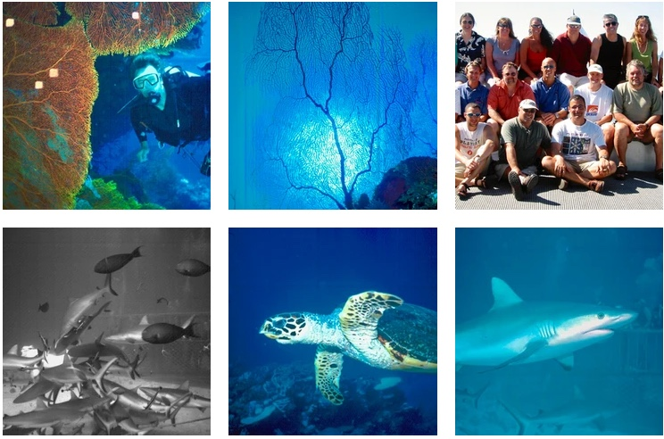

### 16 Apr 2002 - Virgin on the ridiculous



With a little help from a friendly guy at the checkout desk, we uncover a well hidden, but extremely expeditious expressway out to the airport and are there with lots of time to kill. This turns out to be a good thing as the lines are out of the door. We're flying for the first time on *Virgin Blue*, which is a bit of a bargain basement airline, so we're somewhat resigned to a long wait. However, the counter staff are extremely efficient (they could show their US counterparts a thing or two) and we're done in no time.

Lynn takes off on her flight for Adelaide, but I have a couple of hours to kill before my flight leaves. The terminal is a bit of a pit and there's not much to do, but my wait is made more fun by a spotting of Sir Richard Branson himself no less (chief executive of the *Virgin* group, that includes *Virgin Blue*). I figure no one will know who he is over here (he lives in the UK) but he's mobbed and takes half an hour to cross the terminal, being stopped constantly for photos and autographs.

## Out back of beyond



After hanging out at the local marina bar for a bit in Townsville, we all pile on board the good ship *Spoil Sport*, our home for the next week. This is a magnificent dive boat - huge and very well equipped, run by [Mike Ball Dive Expeditions](http://www.mikeball.com/). The boat was custom built for the company and it shows - everything has been thought of. Those of you that've been following along will know that I went out with Mike Ball four years ago on the [Super Sport](/blog/south-pacific-1997/queensland-and-the-great-barrier-reef/), but this ship is definitely a notch above that boat.

Anyway, enough of the gushing already - you had to be there to appreciate it. We cruise through the night out to the Yongala Wreck, which is quite interesting if you've never tried this before. It's not too rough, but it's still a bit like being on a roller coaster while lying in bed. Definitely Dramamine time.

Our first days of diving is on the Yongala Wreck. This is an old passenger steamship that went down in 1911, taking 121 people to the bottom. The site is miles from the nearest reef and so there's nothing but sand all around. Therefore, all the wildlife is concentrated on the 300' long wreck, and in incredible density. Words fail me to describe the variety and volume of creatures to be seen. For those of you who grew up watching Jacques Cousteau documentaries, cast your mind back to some of the very best footage and you'll have some idea what we're talking about here. On a single dive here you'll see more stuff than on 50 dives elsewhere.



This week long trip is classes as an 'exploratory trip', and for the next few days we do just that. Some intense overnight sailing brings us to **Abington Reef**, and later to the **Diamond Islands**, putting us 200 miles off shore. These dive sites are so far off the beaten track they haven't seen a diver for at least 5 years. It's quite a thrill and privilege to jump in the water and to know that no one has seen what you're about to see. 📷The Diamond Islands are particularly spectacular - small sand cays surrounded by huge fringes of coral reef. Very Robinson Crusoe like. East Diamond is home to a lighthouse and uncountable thousands of birds - frigate birds, boobies, terns and many more, so many that the sky almost turns dark with them. We take an outboard over to the island one afternoon and have a bit of a walk around. The noise is astounding and the smell something else. This is a nesting site for these creatures and space is at a premium - the ground is thick with nests, right down to the edge of the beach. These birds have probably never seen a human before and are more curious that shy, so its easy to get very close to them.



The diving out here is wonderful. Not quite the density of wildlife that we saw on the Yongala Wreck but still lots of stuff to see including turtles, rays, huge wrasse, sharks and much more. The reef is riddled with caves or 'swim through', which make for some interesting times, especially when the cave narrows and becomes more of a squeeze through.

You tend to assume that everything there is to be known about the Great Barrier Reef has already been discovered, documented, put in a nice glossy textbook and is now for sale at Amazon.com. No so - there are probably thousands and thousands of fish species alone yet to be discovered, let alone described. For example, on one of our dives out here, my dive buddy Murray discovered what appeared to be a new species of anemone fish.

### The Great Barrier Reef

Five days into the trip and we've all settled into a very comfortable routine that largely consists of eating, diving, drinking and sleeping. We're averaging four dives a day, and although they're none too strenuous, we're all ravenously hungry all the time - when the bell rings for a meal, it's a stampede for the galley.

We've been blessed on this trip with fantastic weather, calm seas and very special diving. We hop around the Great Barrier Reef, taking in sites such as *Anemone City*, *Trigger Happy* (named for the photo opportunities), *Cod Wall* and *Scuba Zoo*.

The latter is the "dive with the sharks" site. We've seen numerous reef sharks along the way, but this is where they ring the dinner bell, summon them in great quantities and actually feed them. It's quite an experience, especially the point where they release 50 pounds of dead fish into the water and the sharks go into a feeding frenzy. It takes them no more than a minute to devour the lot.

### Back on dry land

Before we know it, the trip is over and we're back on dry land (although it feels like it's still rocking and rolling). We say fond farewells to our new found friends and go our separate ways. After spending a night in Townsville I'm heading for Adelaide tomorrow to rendezvous with Lynn, which takes us on to the next chapter in this journal.
