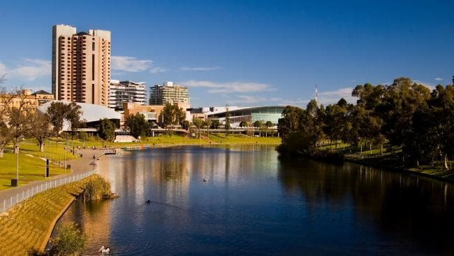

## 26 Mar 2009

After another late and lazy start to the morning, we swing by one of our favourite wineries (Hugo) to stock up and then head back to towards Adelaide. First stop – Stirling, just down the road from Hahndorf and home to a recently discovered bakery / foodie store that is simply marvellous. Highlights include real baguettes, brownies to die for and lots of other digestibles for the discerning consumer who are not so concerned about their waistline. We stock up.

While browsing for places to rent (we’re thinking of spending a year out here after our travels), Lynn gets talking to a realtor who’s about to put a nearby cottage on the market. It’s out in the country, on about 10 acres of land and overlooks vineyards and a beautiful valley in the Adelaide Hills. This is the kind of place you can imagine waking up to in the mornings….we plan on checking it out next week. Who knows, this could be our next home.
