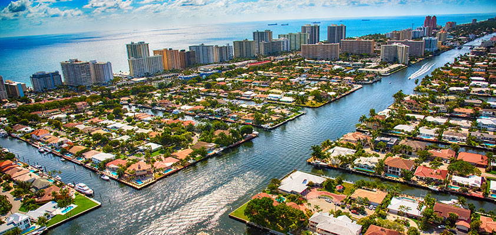

We’d given some thought to other places in the states that we might like to live in, but due to our craving need for a hot climate and an acceptably cosmopolitan atmosphere, Florida was the only place we could up with as a potentially acceptable backup destination, should the plans for Australia fall foul of the immigration bureaucrats.

Having spent, between us, perhaps 3 or 4 weeks in the state to date, we figured that we should really go over and take a look to see if this was an acceptable second choice after all.

Many of you are probably wondering at this point – why on earth would anyone want to move there? It’s sweltering hot & humid year round and full of swamps, bugs and the blue rinse brigade, right? Well, kinda. True, it is hot, but that’s the way we like it. Sure, some areas are predominantly populated with retired New Yorkers, but we hear that some other bits aren’t too bad. And the bugs and swamps – well, we’ll just have to see.

And anyway, this is just plan B right? So, we don’t have to take it too seriously. Just a little vacation, disguised as a research trip.

### Visa Madness

Much of my time since we got back from Florida has been divided between learning to fly (with the help of an airplane *and* an instructor) and applying for an Australian work visa. I have to say the former is proving to be easier and a lot more fun.

I think we decided to move to Australia a generation too late. Back when, anyone who wanted to move there would be welcomed with open arms. Hell, if you stayed for a year they’d even pay for you to get there. Niceties like visas, qualifications and job experience were unheard of. The only qualification you needed to get in was a desire to try it.

Sadly, things are a little different today. Independent immigration is a reasonably equitable points based system. The more points you get, the more chance you have of getting in. If you don’t have enough to reach the ‘pass mark’, don’t waste your time applying. You mainly get points for being young (over 45’s need not apply), an English speaker and having an occupation that’s in demand. Race, creed or color doesn’t enter into the equation (although it used to).

That’s the good news, and according to the check list, I have enough points to pass Go and pay $200. The bad news is that the Australian Department of Immigration (DIMA) appear to have learnt their trade from the American Immigration and Naturalisation Service (look up bureaucracy in the dictionary and it says “see United States INS Department”).

Having the points is one thing. Proving it is quite something else. Over half my points are based on my chosen occupation of “Information Technology Manager”. But, before I can even apply for the visa, I must plead my case to the Australian Computer Society so that they can officially certify that I am indeed a fine, upstanding and qualified IT Manager. The fact that I’ve been gainfully employed as such for many years isn’t enough for DIMA apparently.

The ACS application is an exercise in pure academic bloody mindedness. You would have thought the goal was to prove that I was qualified to *work* as an IT manager, but no. Rather they are looking to prove that my work experience is a suitable substitute for a degree in computer science, regardless of how a prospective employer might view this experience. To quote from the ACS forms: “*In short, the qualities which make practitioners valuable to their clients and employers are not necessarily those which promote a wide knowledge of contemporary information technology for which [an application could be certified].*”

Mind boggling. Still, the application (and substantial check) is on its way to the ACS, so, in a month or two we’ll see what they have to say.

### 26 May 2002

So much for planning. Today, after having our house on the market for just five days, we sold it. We were tempted to say no to the buyer (“it’s just too quick!”), but the offer was too good to refuse (they paid our asking price, gave us almost two months to vacate and they were cash buyers).

Still, it’s enough to freak you out (and believe me, it did). Now our idealistic plans for a lazy, extended move have been thwarted and we need to work out where we’re moving to, and quick. Just knowing which continent would be a start.

### 29 May 2002

Suddenly our trip to Florida takes on a new sense of urgency. I’m writing this sitting on a United flight to Orlando. I’m heading out a couple of days early to see if I can watch a shuttle launch (yes, I’m one of those types) and Lynn will be following me out on Friday.

We plan to start in Tampa and Sarasota, on the west coast and see what its like (the consensus from friends and family is that this is a good place to start). From there we’ll head south along to the coast to Naples, and then head east, through the Everglades and across the state to Miami, Fort Lauderdale and Palm Beach (home of the greatest voting screw up in the history of America).

To round off the trip, we’ll fly up from Miami to Washington, DC and spend the weekend with my brother, who’s just moved out here from England.

### 31 May 2002

I’ve spent the last two night at the *Celebration Hotel* in the Town of Celebration, Florida. This is the ultimate planned community, an entire town designed and built from scratch by the Disney “Imagineering” department. If this sounds like staying in downtown Disneyland, it is. Not quite sure what possessed me when I booked it, but it’s too late now.

Still, the effect comes off reasonably well. It’s certainly pretty and very clean, and not a single pair of Mickey-ears in sight. But two nights are more than enough.

I ambitiously decide to go for a jog around some of the numerous lakes after I check in at 5 PM. Those who know me well will be near fainting with the shocking revelation of Nick exercising, but yes, it’s true. However, this is all still rather new to me and to date, I’ve only been running at home in Oregon, in a much more forgiving climate. As I quickly discover, running in 90 0F and 99% humidity is something else all together, and after a couple of miles I’m all too ready to jump into the lakes, rather than run round them. I decide that tomorrow I’ll run first thing in the morning when it’s cooler – should be a lot easier then, right?

Wrong.

Thursday morning, after standing in a cold shower for an eternity trying to stabilise my body temperature, I head east toward the Atlantic coast and the Kennedy Space Center to hopefully catch sight of the shuttle STS-111 climbing towards the stars. I figure (naively as it turns out) that since this is midweek and a school day, it won’t be too busy.

How wrong I am – it seems like half of Florida have also decided that this sounds like a fine plan and have joined me at the visitor center. There must be 10,000 visitors there if there are a dozen. I spend a few hours trying the to enjoy the center, but eventually get frustrated and annoyed by the countless hordes and the idiocy of most of the exhibits.

The KSC visitor center has consistently been one of the most popular attractions in Florida since the late sixties and now gets millions of folks passing through each year. We’re not just talking about folks burnt out on Disneyland and looking to fill their last day before going home – most of the people here appear to have a genuine interest in the space program and all that that entails. Why oh why then does the KSC feel that the average IQ of it’s visitor is 70 and their attention span no more than 60 seconds tops? There are some notable exceptions (the rocket garden and the meet-the-astronaut programs), but most of the exhibits are shallow, trivial or downright insulting. KSC apparently spent $120M recently on upgrades and improvements, but I’m hard pressed to spot the difference from 5 years ago.

Up until recently, you used to be able to take a bus & walking tour to many of the restricted areas of the KSC, including the huge Vehicle Assembly Building, the shuttle launch pads and the new International Space Station control center. But, between the post 9/11 clamp down and the pre-launch restrictions, a visit to the Saturn V exhibition building was the only highlight of our tour (although the sight of a complete Saturn V launch assembly inside the building was admittedly quite impressive).

Still, I’m not here to tour the facilities, I’m here to watch a few million pounds of highly flammable chemicals consumed in short order. A couple of hours before the launch I find myself hanging out at the only alfresco bar in the visitor center with several like minded soles. We’ve toyed with the idea of paying an extra $15 to get on a bus to a viewing site perhaps 3 miles closer to the action, but after seeing that perhaps 7,000 visitors are in the process of doing the same thing, we determine that *right here* is by far the best viewing spot. 

Unfortunately, it’s not to be. Twenty minutes before the designated time, the launch is scratched (there, I’ve picked up the lingo and everything) due to weather. At this point our decision to skip trip out to the viewing area turns out to be highly enlightened. While those poor saps are getting bused back to the visitor center, only to spend countless more hours stuck in traffic, I’m long gone and heading back to my hotel.



And what a drive back it turns out to be – right through the thunderstorm that the wise gentleman from NASA decided was rough enough to cancel the launch. It’s a doozy – black skies, waterfall style rain and almost continuous lightening strikes, some no more than 200 yards away from my car. It’s at this point that you really realize how flat Florida really is and you hope that the roadside power pylons don’t run out, because if they do, *you* are suddenly going to be highest point around!

Still, I survived to tell the tale (obviously) and now, Friday morning, I’m heading west from Orlando toward Tampa to pick up Lynn and make a start on the real purpose of our trip – home hunting!

But wait! I have a few hours to kill before Lynn’s plane is due to land, so I detour to Sarasota (about 50 miles south of Tampa and currently top of our candidate list for potential future Elsey – Florida residences) and swing by the aviation school for an hour’s flying and sightseeing.

I’m still learning the art of throwing an airplane around the sky (or more importantly, putting it back down on the ground afterward), so I bring one of the local instructors along for the ride. Dave gives me the option of heading northing into Tampa’s class-B airspace or south toward the class-E airspace of Naples. For the non-pilots among you, this is kinda of like offering a surgical student, on their first visit to the operating theatre, the choice between removing a mole and a particularly tricky heart-lung replacement operation. Needless to say, I went for the mole removal, and metaphorically speaking, had a great time doing it.

## 1 Jun 2002

Having picked up Lynn at the airport and checked into the Pier Hotel in Saint Petersburg (quaint is the best adjective I can use), we spend the day touring this town and north to Clearwater, Tarpon Lake and environs. While  it’s not the worst place in the world that we could choose to live, it’s not ideal either. We have alternating flash images of California strip mall, run down ramshackle towns – ‘Deliverance’ style and expensive high rise beach front condos. Still, between the trailer trash and the developer madness, there are some spots that don’t look *too* bad.

Downtown Saint Petersburg turns out to be quite inviting, including major pluses of a varied grocery store and great wine bar (these factors are second only to availability of air & water in importance when selecting a place to live).

So, not totally disheartened, but with high hopes of finding something better, we’ll be heading south tomorrow morning to rendezvous with a realtor who’s eager to show us the community highlights of Sarasota. We shall see…

### 3 Jun 2002

Sarasota was a bust. After spending Sunday morning touring houses with a friendly local realtor, we decide that this area might well be quaint, but there ain’t anything to do here. Sarasota is about 50 miles south of Tampa on the south side of Tampa bay, too far to commute into Tampa for work, not big enough to offer us gainful employment locally.

The city sprawls for many miles in all directions, and it seems like countless new 10,000 home sub divisions are springing up every year. God knows what all these people do down here – certainly not work. Unfortunately, even though the vegetation is very lush round here, the developers have a habit of bulldozing out all the greenery when they put in a new subdivision, so there’s nothing left but grass between the houses and so absolutely no privacy. It seems almost impossible to find a nice, newer house in an older more established neighbourhood.

We were supposed to spend the night here, but by early afternoon we abandon the city and head south for Venice (nothing much to report here) and on to Naples. This is smaller city that also seems to cater solely to the retired crowd, this time the ultra rich segment. We spend the night here, and have fun ogling the ridiculously expensive & kitsch stores. The center of old Naples revolves around a row of beach front houses known as millionaires row; and these houses were built in 1886. Need I say more.

So, by Monday morning we’re heading east, towards Fort Lauderdale, crossing what is ominously known as ‘Alligator Alley’. This turns out to be an arrow straight stretch of freeway through the everglades, which unlike the movies, consists primary of an awful lot of long grass as far as the eye can see. The occasional rest stop gives you the opportunity to pee, stock up on carbonated sugar drinks, check out the alligators in the adjacent swamp (I think they must survive on tourist handouts) and launch your boat.

Yes, I’m not kidding. Sixty miles from the ocean, in the middle of nowhere, surrounded by countless miles of swamp, bugs, oppressive heat and peckish reptiles, there are boat ramps where you can launch your watercraft of choice and presumably go fishing (although what there is to catch I can’t imagine). It never ceases to amaze me the predilection of anglers to be able to go fishing in the most unlikely of places. We later pass a couple of guys in a small dingy, fishing in the middle of what can only be charitably described as a large puddle in the middle of a freeway intersection. Perhaps they were angling for hubcaps?

### 5 Jun 2002

It’s Wednesday, so this must be Ft. Lauderdale. I feel like we’re on some kind of nightmarish package bus tour where you get to see 7 cities in 6 days. To add to the disorientation, I wake up every morning thinking we’re back in Australia, since that’s the only other hot and sunny place we’ve been to in the past year. I think my body is trying to tell me that we need to move down under, rather than go east.

Still, on with the quest. Learning from our Sarasota mistake of looking at houses when we had no idea about the lay of the land, we’ve been spending the past couple of days driving in ever increasing circles around downtown Ft, Lauderdale, trying to find a nice / affordable / private / convenient neighbourhood. By lunchtime today, we conclude that such a beast doesn’t exist, at least for what we’re prepared to pay. Sure, there are lovely established suburbs right near the city center, but for ½ million dollars you get a shack. On the flip side, you can have your McMansion, complete with some land, but it’s an hours drive from downtown and it literally backs onto the everglades (alligators in your swimming pool for free!). We conclude that while Ft. Lauderdale might have a lot more going for it (starting with actual employment opportunities), the cost of living is (of course) proportionally much higher.

Still, it’s an interesting place to visit. This place should really be called Venice – inland waterways permeate for miles inland, and there must be tens of thousands of properties that back onto them (increasing their value in the process). The developers, knowing a sure thing when they see one, have built whole sub divisions where the streets alternate with canals, so that every house can have a 40’ yacht  tied up at the end of the yard.

And what yachts they are. Unbelievably large floating gin palaces tied up at the end of just about every other house. Even though the houses sell for millions, many of them have more money tied up in the boat than the property. Where on earth does all the money come from?

We’re beginning to realise that this city has a frightening high proportion of well to do wannabies. The boats are just one manifestation of the cultured snobbery of the area. Another is the names they give to some of the suburbs. Names like “The Enclave”, “Croissant Park”, “The Outback” and “Polo Club Estates” give you a clue. Most of these places are gated communities, which tells you something about the paranoia of the folks behind the walls.

We round out the afternoon heading north along the beach toward Boca Raton, if for no other reason that it’s reputation for intense pretention (we have to go see) and the names similarity to the fabled Seinfeld Sr. retirement community of Boca Vista. I’m happy to report that Boca Raton lived up to our expectations and indeed exceeded them. To date, it’s the only place I’ve been to that offers valet parking for the shopping mall!

We have a couple more days in Florida before we’re due to fly up to Washington to stay with my brother, but by this point we’re totally burnt out on house and home hunting, so tomorrow we’re heading south to the Florida Keys, to see if we can’t catch ourselves some tropical island relaxation instead.

### Back in Oregon

So, here we are, a week later back in Oregon, and with a whole new set of plans and ideas to tangle with. By the time we left Florida on Friday, we decided that the state really wasn’t for us. Although the weather gets high marks, everything else gets a failing grade. To sum it up, the state seems to be seriously lacking in character, charm, culture and a cosmopolitan feel (and probably many other adjectives starting with ‘C’).

On the up side, we fell in love with Washington, DC in a weekend.

I had been there for just a week a few years back, and Lynn took it in on her high school highway history trip when she was fifteen. Needless to say we both had fond, if rather fuzzy memories of the place, but didn’t really expect them to be confirmed by current reality.

We stayed with my brother, who had recently moved over with work from the UK, in a lovely town house in the middle of Georgetown. Although the climate in DC is less than ideal perhaps 5 months of the year, for character and substance, DC is to Florida what the London Symphony is to Britney Spears. We basically liked it. If you’re prepared to commute a bit (well, actually quite a lot), the housing isn’t too expensive either.

Since the Australia visa thing is taking longer than expected, and now having sold our house in less than a week, we find ourselves in need of a home for a two or three months. Rather than loiter in Oregon in some apartment, we’ve now decided to spend the time in DC instead. That way, if the Australia thing falls through, we’re right where we want to be. To this end, we’ve spent the last couple of days investigating all the exhausting complexities of shipping, storage, and all the complexities of moving from here to Washington, and then on to Australia.

For example, did you know that the United States is the only country in the world that measures transportation costs by weight, rather than by volume. Therefore, if we move all our worldly goods to DC, the heavy stuff makes it expensive (and believe me, it’s expensive). But, if we move to Australia, the bulky stuff adds to the costs. So, we’re now in the process of wandering through our home, trying to decide what’s bulky, heavy or has generally outlived its welcome.

 
