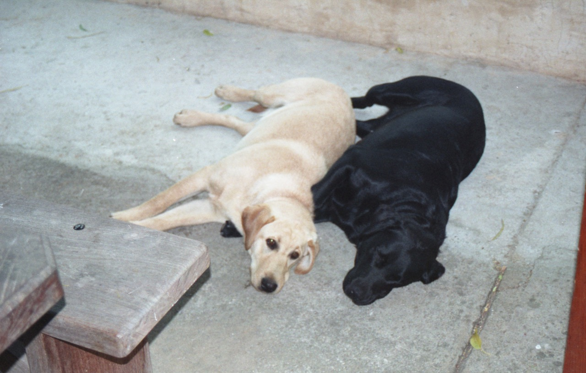

Greetings, and welcome to chapter 5 of the journal, which brings us to beautiful Adelaide and the Barossa valley in the state of South Australia. This chapter is a little brief, mainly since all the boring repetitive bits have been left out (boring to you anyway).

We got a little exhausted by all our traveling to date, especially the "see city XXX in a day" stuff, so we kinda slowed down around this point. In fact, we found this lovely little place called Miner's Cottage and just couldn't get away for quite some time. But I'm getting ahead of myself….

### 3 Mar 1997 - Barossa Valley



We arrive in the afternoon on the flight from Perth. It took us 1½ hour less time to get back to Adelaide from Perth than it took us to get there. Go figure that one out. We drive through Adelaide on our way out to the Barossa valley and we like what we see.

Adelaide was laid out on a grid pattern, but unlike many other USA cities that have suffered big-time urban sprawl, the city center of Adelaide is surrounded by parks on all sides. Outside the parks it has a number of 'suburbs', but frankly you can walk across the area cover by this map in 20 minutes - it's not a big city.

After a little hectic detour to the tourist information office (exit Lynn carrying a huge pile of brochures and leaflets) we drive out of town into the Barossa Valley, heading for the town of Birdwood. We drive though the rolling Adelaide Hills on the way - very dry at this time of year.

Tonight we stay in a tin hut that’s been 'quaintified' (new word for your dictionary). Nothing spectacular. The only place to eat is the Birdwood Hotel, that turns out to be OK, if a little rough around the edges.

***Aussie Hotels****: Just about every small town in Australia always has a 'hotel' in the middle of it. This is really the place where the boys come to hang out and drink beer. Attractions include beer (cold and lots of it), tough looking outback types drinking said beer, pokies (a.k.a. slot machines, one arm bandits, poker machines) and possibly a restaurant (of the "all meals $5.99, Tuesday night is schnitzel night" variety). Oh, and a room or two to sleep in.*

## 4 Mar 1997 - Barossa Valley



Up and at 'em. Today's the day we make our second great pilgrimage of the holiday - Yalumba (our first was to Cloudy Bay). This winery produces one of the greatest inexpensive sparkling wines we've ever tasted. Called "Pinot Noir Curvee One", it can be had for less than A$10 out here (US$6.60). We used to drink it like water in the UK, but went through an enforced period of abstinence when we moved to the USA. I'm happy to say they started to imported it to the states last year. Anyway, we went to pay homage and try some of their other offerings. We were welcomed like long lost relatives and had a great time. Didn't leave empty handed either.

After a brief visit to another winery (Seppeltsfield) we have lunch at the café Lanzerac in Tanunda. Then we're off to our accommodation for tonight….Miner's Cottage. Boy did we love this place!



It's just outside a town called Lyndoch (for those of you who're following all this with a large map of Australia at your side), in the Cockatoo Valley. And they call it that for a reason, because the area is thick with the things. After staying here I've decided never to own one of these birds. They are beautiful to look at and when there's a whole flock of them flying around in their native habitat, it's a sight to behold, by wow, do these guys make weird noises. Around dusk each night they seem to wake up (stopping their snoring and groaning noises) and start to fly around making these incredible screeching calls. Amazing.

Anyway, the Miner's Cottage is just what it sounds, a little old stone cottage, very low doors, cool inside and beautifully appointed, with a porch outback that looks down into a beautiful garden and then out over the hills. The owners (Brenda and Godfrey) live next door and became good friends during our stay. Also of notable mention was Lucy (the 3 ½ year old petulant daughter) and Holly & Daisy, the two *very friendly* Labradors.



We work out the kinks from our day’s driving by taking a walk up through the hills to the Whispering Wall. This is actually a reservoir dam that has an unusual property. If two people stand at the top of the dam (one on each side) and whisper towards the dam wall, the other person can hear them as if they were 2 feet away, when in fact they’re 500 feet away. Holly and Daisy accompany us on this little walk and become our constant companions on all the subsequent walks and runs we take. They’re great fun to have along, even if Daisy is predisposed to jumping into the muddiest of puddles and then shaking it all off right next to you.

### 5 Mar 1997 - Barossa Valley

Today we hit the wineries of the Barossa valley with a vengeance.

Barossa produces abut 85% of Australia’s wines and it shows – the wineries we visit are no-nonsense places – dedicated to high quality, good value wines with none of the tourist frills we found in other places (such as Margret’s River).

Highlights included Henschke, Peter Lehmann, Yaldara and Seppeltsfield wineries. The last two have the most amazing old stone buildings – worth a visit just in themselves.

A picnic lunch at Peter Lehmann and then back to Miner’s Cottage to generally loiter for the afternoon. Dinner’s at The Park back in Tanunda. I devour some more of the local wildlife and Lynn sticks to chicken.

### 6 Mar 1997 - Adelaide

We're off to Adelaide for a couple of day this morning, but we decided that we love Miner's Cottage so much that we're coming back here after that. We arrive in Adelaide mid morning, grab some lunch and then split up for the afternoon. Lynn goes shopping and I wander the city, covering lots of territory and getting some significant blisters into the bargain.

Tonight we stay in the "Old Lion apartments" in one of the trendy suburbs that surround the city center parks. We decide to have a night in, in front of the telly eating takeaway. Australian TV is made up in the most part by English and American imports (thankfully not just the crappy ones), but they do have some good home-grown offerings, including a local version of the show "have I got news for you". This will be familiar to the UK readers, but for the rest of you, this is a show where two teams take it in turns to generally take the piss out of the week’s news & current affairs (and get points for doing so). The UK version was one of our favourite shows when we lived there, and the Aussie program turned out to be quite good too. Luckily, we have been reading the papers for a couple of weeks by now so we could actually get some of the jokes.

### 7 Mar 1997 - Adelaide

We explore the hills and towns around Adelaide. Highlights included Mount Lofty (don't you just love the subtlety of this country), which had fantastic views of the city and a very cold biting wind, and Hahndorf, a genuine German town.

We stay in the Georgia Mews Cottages tonight and dinner is at *the* restaurant in town, called "The Oxford". This is, according to the guide books, the place to go. Turns out to be the best food we've had the entire trip.

### 8 Mar 1998 - Barossa Valley

Back out to the Barossa and The Miner's Cottage again today - hooray! Lynn and I are getting a little exhausted by all our non-stop travels at this point, so we're looking forward to a couple of days of doing zombie impersonations. So, this is where the diary gets a little light.

On our way out of town, we stop off in Oakbank to check out a house that’s for sale. Wow, housing is *really* cheap around here, and we're only ½ an hour from the city. We could actually afford to buy our ‘dream house’ here. The way they sell houses in this country is a little unusual though – the vast majority are sold by auction. None of the listings we’ve seen give any indication as to how much a house might sell for, so we’re not quite sure how you can shop around.

Anyway, after a picnic lunch at Yalumba (they’re getting to know us by now), we arrive back at Miner’s Cottage.

### 9 Mar 1998 - Barossa Valley

Lazy day. Bit of eating and drinking, bit of exercise with the dogs. Back to bed.

### 10 Mar 1998 - Barossa Valley

For the second time this vacation I actually get up early and go jogging. I’m a physical wreck after about 100 feet, but the dogs keep me going.

We were going to move on today, but Brenda (the owner) has given us a free night, so we again spend the day recharging ourselves. A bit of wine tasting in the afternoon after lunch on the BBQ s is about as exciting as it gets.

Tomorrow we’re starting our drive towards Melbourne, which means a new state (Victoria) and a new chapter in this journal……until then.
