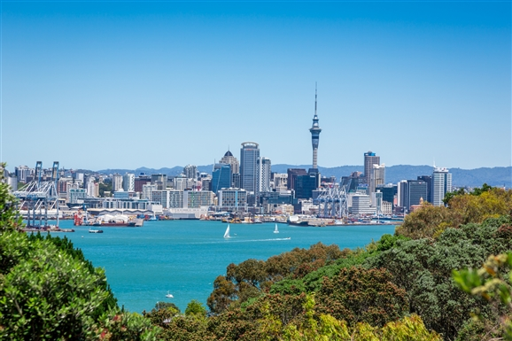

### 14 Feb 1997 - Auckland & Whangarei

Wow, Valentines day. And what a way to spend it. We woke up in the Kiwi International Motel in Auckland. A nice enough place, if a little sparse. Still, the Air New Zealand pilots stay here, so it can’t be all bad.

I have a genetically based bigotry against any hostelry with the word "Motel" in it’s name. This comes from being born and bred in England, where Motels are places that axe murderers and bikers stay. Here in NZ, everything is either a motel or a Bed & breakfast. The former pleasant enough, the latter having less facilities and triple the prices.

Anyway, off to the Avis desk at the airport again to pickup our car. Mass confusion because we’re 2 days early (even though we faxed them the changed date). Our prepaid voucher amazingly doesn’t pre-pay quite enough (it's incredible how car rental agencies can pull all sorts of additional charges out of the air when they need to).

Finally we’re off, heading north toward the Bay of Islands – Auckland’s playground. I read in Frommer’s that Auckland has more boats per capital than anywhere else on the planet. Driving past the marina downtown you can believe it too.

As we get further north, the countryside appears with a vengeance. It’s just one park, forest or reserve after another. The trees are a mix of coniferous, rain forest and strange looking giant fern trees (which I’m sure aren’t called "giant fern trees").

We stop at the Puhoi Hotel, in downtown Puhoi for a beer and burger. This is a tinny little town that is currently swapped by visitors to the annual country show. Still, we find a parking space and sit on the top of the hill outside the pub, drinking (good) cold beer and watching the world (and the local weekend bikers) go by. Very pleasant.

In the afternoon we make it to the Settlers Hotel in Whangarei (and that’s one of the easier Maori words). Once again, ‘motel’ fits the NZ definition rather than the British. We spend the rest of the afternoon dawdling through various parks and reserves, generally checking out the flora & fauna. This place is beautiful. We are already talking about "how could we come an live out here" which only happens when we *really* like a place.

OK, up to date again. I’m quaffing my wine (a cheeky little Sauvignon Blanc from Montana) as Lynn’s getting really hungry. We’re off to the local marina from a spot of dinner. Later.

### 15 Jan 1997 - Whangarei and Bay Islands

We wake after a another surprisingly good night’s sleep, considering this is only a double bed. After the king size at home it seems way too cramped. Lynn makes me tea and I lounge around and read while she goes jogging. I’ll start exercising any day now.

Today we’re off on a jaunt up north to the "Bay of Islands". This is just what is sounds, a large bay with 144 islands, and about 10 times that many tourist attractions. This really is the playground of the North.

We drive through several towns around the bay that look like a NZ equivalent of Brighton or Blackpool. Lots of tea shops, cafés, gift shops and water-oriented tourist attractions. After stopping for a bit of lunch, we head north again, pausing briefly to take in the Haruru Falls (which don’t fall very far) before reaching the town of Kerikeri.

Here we hit up our first two wineries of the tour – Marsden (very nice) and Cottle Hill (run by a very arrogant guy from San Diego no less), before proceeding to our northernmost point of our trek – the **Aroha Island Ecological Center**, home to some of the last Kiwis in NZ (their national icon). They say these bird are very shy and they’re right, the only ones we see are stuffed or on video.

And now we start our run south. Back to the Settlers Hotel for tonight and then an early start for the long run down to Lake Taupo and the geysers!
