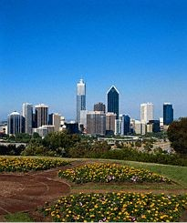

### 26 Feb 1997 - Fremantle

Welcome to the next chapter of the great vacation diary. As I'm sure you've noticed, this journal has grown too large for one page and I've broken it down into separate chapters. It's amazing how much time you can spend doing this kind of thing.

Here we are in Australia. Our first stop is in Western Australia.

***Some WA facts****:*
*This is an amazing country and an even more amazing state. For example:*

- *Australia is about the same size as the United States of America, but only has a population of 18 million, compared to the USA's 260 million.*
- *Western Australia has a population of only 1.7 million, but it occupies 1/3 of the entire country - 1 million square miles.*
- *Of that, 70% of western Australians live in the state capitol, Perth. That works out to around 1 person to every 2 square miles outside Perth.*
- *The two main industries in this state are mining and sheep. With the latter, they don't mess around, sheep farms (or stations as they call them here) can be as large as the state of Kentucky.*
- *Perth is remote. It's 2,000 miles from the next major city. In fact, it's closer to cities in Indonesia that it's nearest Australia neighbor, Adelaide (2,600 miles away).*
- *There are places in this state where you can be almost 1,000 miles from any road, and that's just a dirt track suitable for 4wd vehicles only.*

So, last night (and tonight) we stay in the **South Beach Apartments** in **Fremantle**. This is a town about 15 km SW of Perth, where the Swan River reaches the Indian Ocean. Once again, the apartment was great - two bedrooms, separate kitchen & lounge and all the appliances! Our apartment (and several dozen more) are located in an old biscuit factory on the south side of town. This area is rapidly being 'yuppiefied' with all the old buildings being converted into swanky apartments, bars, restaurants, etc.

Bit of excitement this morning. I was trying to cook some eggs when I produced a huge cloud of smoke after dropping some butter into a pan that had been heated to about 2000o. Moments later we hear a distant alarm, but fail to make the connection. The manager is soon knocking on our door. We assume she's her to introduce herself (since we arrived late last night), and her intro of "is everything all right?" contributed to this assumption. But…it turns out she's here to see if we've burnt to death yet.

"No, everything's fine", we say, "but we could use a frying pan" (missing from our inventory).

Off she goes and few minutes later there's another knock at the door. Cool we think, that was quick. I open the door to be greeted by a contingent from the local fire brigade! Opps.

We drive back up to Perth to explore for the morning and rapidly fall in love with this city. The downtown is compact and quite beautiful. All the buildings are either older stone 2 / 3 story or a (limited) number of modern skyscrapers. The places is crawling with parks and gardens. The city is on the side of a hill that gently slopes down to the **Swan River**. Fantastic. I can see why everyone who comes here thinks it's the best place to live in Australia. Even Lynn, who was less than keen to come to this part of the country is quite effusive about the place.

We drive over the river to **South Perth** for lunch and then return to the north side to pay a visit to **Kings Park**. This overlooks Perth and claims to be the largest forest park within city limits in the entire southern hemisphere. Or something like that. We're learning that the Aussies & Kiwis like to lay claim to the largest, widest, tallest or oldest something or other in just about every town in the country. Anyway, the park was big.

Back to Fremantle, detouring to the beach to stick our toes in the Indian Ocean (a first for us). I can reliably report that the Indian Ocean is *cold.*

Off for a wander downtown. Now this is a place I could grow to love. Very quaint town, not at all touristy and some beautiful architecture. That have a street that known colloquially as "**cappuccino alley**" and it's busting at the seams with restaurants, cafes and bars. We felt quite at home.

Dinner was at the **Sail and Anchor** on cappuccino alley. Lynn has something light and healthy, while I devour Kangaroo parcels (basically, Roo in filo pastry). Another member of the local fauna to tick off the list.

### 27 Feb 1997 - Fremantle & Margaret's River

We prepare to depart Fremantle for 3 days down at Margaret's River. This is a town about 3 hours south of here that’s supposed to be very nice, and coincidentally happens to be in the heart of WA wine region. Amazing coincidence! It'll be good to spend 3 days at the same location without having to pack.

The place we're staying at has a barbie (that’s Aussie for BBQ, not a bimbo doll), so we stock up on the appropriate basic food groups (meat, wine, beer). Lynn's discovered the best grocery store in town, called Coles (she's like a bloodhound for these things) and I have to say I'm impressed. Never go shopping here when you're hungry.

After that, Lynn dumps me outside the local hippie hangout for a massage. This will be my first. Ever. In my life. I have to say this is not exactly my favorite way to pass time, but I've had a very painful neck for about two months now, and the pain has finally won over the reticence. Twenty minutes of some serious dope music and I have to say I'm no better for the experience.

The drive down to Margaret's River was quite interesting. Every time we thought we were out in the back of beyond (or outback as they call it round here), we would come across another residential housing development. Each looked very palatial and we began to wonder what the hell everyone did around here to afford these places, and more to the point, where did they go to earn it.

Our accommodation turned out to be great (again). Lynn is proving to be a whiz at finding all the best places to stay on this trip - she should become a travel agent. They go by the name of **Waterfall Cottages**, but unfortunately the waterfall dried up several months ago (together with the entire river) and it's not due to make a reappearance for some time to come. They don't mess around with summer round here.

Our first winery visit of the region was to **Cape Mentelle**, which is owned by the same company (Veuve Cliquot) as owns Cloudy Bay, so we had to pay it a visit. I'm sorry to report that their wines were not up to Cloudy Bay's standards and more expensive to boot. This sorry state of affairs was to be repeated at all the other wineries we visited in this region. Still, we know that well be tasting better and more reasonably priced wines at our next destination - the Barossa Valley outside Adelaide.

And the big excitement of the day - on our way back to the cottage in the evening, we saw our first kangaroo in the wild! Just sitting there in the middle of the road. It turns out that these guys are best seen during dawn or dusk. This is borne out when Lynn is practically mobbed by a whole group of them tomorrow morning.

### 28 Feb 1997 - Margaret's River

After successfully cooking some breakfast without summoning the fire brigade, we head out into the uncharted territories of the Margaret's River wine region. Actually, it's extremey well charted by several maps and guides, but it's all new to us. We pay a visit to **Cullens** and **Vasse Felix**, two of the best know wineries in the region and the latter recommended by the New York Times (which has yet to let us down). Unfortunately, it lets us down. These wines are OK, but overpriced.

So, on to the beach for a bracing dip. We pick the beach that according the surf guide has the largest waves in the region. We get there to find that the waves have been given the day off - I've seen larger swell in my bath water. We stick our toes in the water and wimp out of the planned swim when we nearly loose them to frostbite. Our walk along the beach is enlivened by the local mutt dog that constantly begs me to throw a stick for him.

Our big adventure of the day is an expedition into the **Calgardup Adventure Cave**. This was a 'self guided' tour and we had the caves to ourselves. Quite cool.

### 1 Mar 1997 - Margaret's River

Woken again by the birds at some god-awful time of the morning. You know you're in a foreign and when you hear these guys shrieking first thing. Think back to those corny jungle noises you always hear on the Tarzan movies and the like. Well, this is the country where they recorded them.

Since my vacation to date has consisted primarily of eating and drinking, the old love-handles were getting a little out of hand, so I decided to talk a walk/jog (i.e. jog on the flat bit and downhill, walk up hill). It being dawn or soon thereafter, the countryside was once again thick with kangaroos. Don't know where they find the space to hide themselves for the rest of the day.

Once Lynn and I had returned from our respect exercise outings (we never go together, I don't want Lynn to see the sad fact of exactly how unfit I am), we take off the for the beach. I was determined to brave a dip this time, so I just ran down the beach as fast as I could, working on the premise that momentum would do what willpower failed to do yesterday. I survived full immersion for about 3 seconds.

As we sat at one of the surfer-dude cafés near the beach, eating lunch (Lynn something healthy in a sandwich, me fish and chips), we noticed that one of the tires on our rental car was ½ flat (or ½ full, depending on your outlook on life). Bugger. If we were nice people and we hadn't had so much grief from Avis to date with our car rentals (don't get me started on *that* one) we would get the tire fixed. But it wasn't to be, so we just swapped it with the spare and half-heartedly commiserated with the next customer to get a flat in this car.

### 2 Mar 1997 - Margaret's River & Perth

Once again Lynn rises early to jog and commune with the kangaroos. I lie in bed and drink tea. I reckon that walk yesterday will allow me to feel self righteous for at least another week.

Today we leave Margaret's River and return to Perth. We're staying down town for the night so that we can catch an early flight to Adelaide the next morning. The 3 hour drive back to Perth is fairly uneventful, only enlivened by a forced stop off for lunch in Fremantle (I had to pick up a computer bit I left in the apartments when we stayed here last). Even though today is a public holiday in WA (although we still can't work out what it's celebrating), Fremantle is once again a jumping joint.

We reach Perth around 2 pm and check into the **Miss Maud Swedish Hotel**. You get the idea. After a quick change of rooms, we find it's not too bad, but we've been rather spoilt by all our other accommodations to date.

The rest of the afternoon is spent wandering round town (which is like a ghost town due to the public holiday) and trying to return our Avis rental car (the downtown office is locked up, even though they swear it's supposed to be open until 6 pm. Bastards).

Tonight I will (hopefully) met up with my old drinking buddy and dive partner, Dave. I spent many a Monday night with Dave down the pub in England before emigrating to the states. Dave left for Perth just before me and this is the first time I will have seen him in 3 years. Looking forwarding to pumping him for info on Perth.

Well, that bring me up to date. Until next time…
