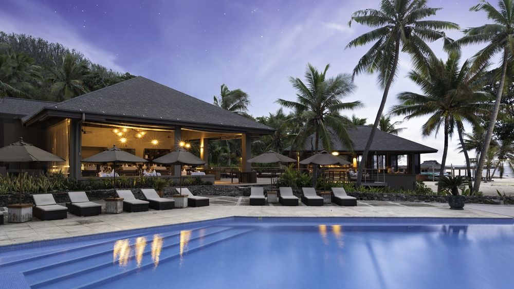

### 12 Feb 1997 - Yasawa Lodge

Our first full day at Yasawa. Breakfast is interrupted by Vili – the activities director, who tells abut all the fun activities talking place today in Paradise. This guy is more camp than Mr Inman ("Are you being served"?).

After breakfast I depart on a snorkeling trip. I’m joined by a newlywed couple from Holland and we’re taken about 15 minutes south in a long boat. There’s no shade in the boat and the sun is already brutal. To our surprise, we’re dumped on a beach and the boat disappears for an hour (to the local village for a gossip we suspect).

Still, the water is warm and there is some nice soft corals, but nothing like the sights at Cousteau.

On the return trip, I huddle under my beach towel, trying to hide every bit of skin from the midday sun. However, the sun outsmarts me (not too difficult to do) and manages to burn the back of my legs quite satisfactorily.

We decide to bail out early. There is just something about this place that we just don’t like. Perhaps if we hadn’t been to Cousteau first, this would be paradise (as Vili keeps informing us it is). Lynn has a word with the manager. I cower by the pool, avoiding the unpleasant confrontation. She returns with good news and bad – yes we can get out on the charter tomorrow, but no they won’t refund us for the two days we won’t be spending here after all. Screw it, we’ll go anyway. We have a growing list of whinges and complaints that we’ll carefully craft into a letter once we leave. Let’s see how they react once we get our letter published in Condé dé Nast Traveler Magazine.

Lynn departs for a trip to the local Fiji village in the afternoon. Apparently, the locals continue to reinforce our impression of a genuinely friendly nation of people. There is a little healthy commercialism thrown in at the end, although Lynn manages to escape relative unscathed with a small shell necklace.

## 13 Feb 1997 - Leaving for Auckland

Lynn has an early morning panic crisis. "We’re wasting all this money by leaving early". She’s spent most of the night worrying about it. Being Lynn, she just can’t make a decision, so I do it for her. Screw it, we’re off. The money’s spent either way (we’re not hopeful for a refund), so what’s the point in staying if we’re not happy here?

We spend the morning on the beach, then back to our room to pack and down to the main lodge for our final meal. Time turns glacial. We swear the word has got around the staff and they’re being deliberately slow in serving us. Finally, we’re on the bus/trunk/bure-on-wheels and off to the airport.

To our horror, we find we’re sharing the plane with the director of the resort! This guy gave Lynn a really hard time of it when she told them we were leaving early. Thankfully, he studiously ignores us for the entire time.

Back to Nadi again. Waste some time rearranging our car rental in New Zealand with Avis and hanging out in the Aero View lounge. No problems getting our Qantas flights (once again masquerading as Air Pacific) changed to today – they didn’t even charge us the $70 fee for the pleasure.

Finally, we off on a little 737, with seats to spare. Lynn and I sit, separated by a seat pilled high with junk, blankets and discarded food & drink utensils. We hand the Frommer’s "New Zealand for $50 a day" guide book back and forth, bewildered at the choices we have to fill our 2 weeks (and 2 extra days) in this country.

I pull out the laptop and begin to type, which gets me up to date once again...
