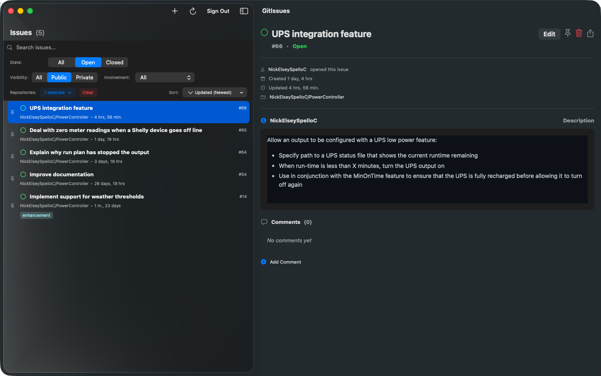

## GitHub Issues, Without the Browser


GitIssues is a focused, native macOS app for managing GitHub issues across all your repositories. No browser tabs, no distractions — just your issues, organised and accessible from your desktop.

Sign in with your GitHub account and get straight to work. GitIssues gives you a clean, fast interface for the things you actually do with issues every day: creating them, updating them, labelling them, assigning them, and closing them — across every repo you have access to.

### Key Features

- Browse and search issues across multiple repositories from a single window.
- Create new issues with full Markdown support and live preview.
- Edit issue titles, descriptions, labels and comments.
- Open and close issues without leaving the app.
- Filter by state (open, closed), repository, visibility (public, private) and your involvement (creator, assignee, collaborator).
- Rich Markdown rendering for issue descriptions and comments.
- View and add comments on any issue.
- Share, pin, clone and delete issues.
- Sort the issue in a variety of ways.
- Fast, native macOS experience - built with SwiftUI.
- Secure GitHub OAuth sign-in - your credentials are never stored by the app.
- Lightweight and private  no analytics, no tracking, no data collection beyond what's needed to connect to GitHub.
- Built for developers who live in GitHub Issues and want a faster, cleaner way to stay on top of them.

### Support and More Information

Please visit the [GitIssues support page](https://www.spelloconsulting.com/gitissues) for more information, support contact and planned features.

