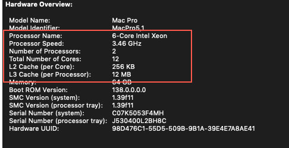


I wrote this article back in 2018, when upgrading an old Intel MacPro workstation was still a viable strategy for a powerful yet cost effective Mac workstation. 
Time has passed and the world has moved on a lot. In 2026, RAM, GPU and storage costs are very high and Apple has completed its migration to Apple Silicon. The new
Apple Silicon laptops and desktops are great value for money (especially the MacMini). 

Furtheremore, the latest version of macOS that these MacPros can support is 10.14 Mojave, which is a long way from the latest release. 

All that being said, I've kept this article here in case anyone's intereste. 



I'm the happy owner of one of these guys - an Apple Mac Pro workstation, the "Mid-2012" edition to be exact. This was the last iteration of this design before Apple released their current (and much maligned) "trash can" Mac Pro in 2013. The Mid-2012 Mac Pro is the last real (aka upgradable) computer Apple ever released - its fully modular, supporting CPU, memory, disk and graphics card upgrades.

It's now late 2018 and the technology in this "cheese grater" (as this version was known) is getting a bit dated. Apple still haven't yet released a new workstation that I (or anyone) would want to buy, so I've been toying with the idea for a while now of upgrading this workstation to something a little more up to date.

Then, Apple released the latest version of macOS (Mojave) and I wasn't able to upgrade because the original graphics card doesn't support Metal (Apple's graphics programming standard). So, my hand was forced. Since I need to replace the graphics card, let's make a project out of this...

## Original Specifications

Mac Pro, [Mid-2012. MacPro5,1](https://everymac.com/systems/apple/mac_pro/specs/mac-pro-twelve-core-2.4-mid-2012-westmere-specs.html).  Currently running macOS High Sierra (10.13.6)

- **CPU** - Dual CPU processor board. Two x 2.4GHz 6-Core Intel Xeon E5645. 12 cores total
- **Memory** - 32 GB 1333 MHz DDR3 memory. Installed as four 8GB sticks, leaving 4 slots free for additional RAM.
- **Graphics** - Original Apple supplied ATI Radeon HD 5770 1Gb.
- **Boot Disk** - Samsung SSD 850 EVO 1TB (previously upgraded from the Apple stock 1 TB SATA hard drive)

### Original Performance

**CPU and Graphics Card** - I used [Geekbench](https://www.geekbench.com/):

- CPU Single-Core Score: 2,241
- CPU Multi-Core Score: 18,262
- Graphics Card Compute: 10,280

**Boot Disk** - I had previously upgraded this to a Solid State Drive (SSD), so this will already be faster than the "stock" Apple hard drive. I used [Disk Speed Test](https://itunes.apple.com/au/app/blackmagic-disk-speed-test/id425264550?mt=12): 

- Write speed: 250 MB/s
- Read speed: 268 MB/s

## Upgrade Strategy

While this is a decent workstation, its core technology is dated. The expansion slots only support the PCIe 2.0 standard (not the latest PCIe 3.0), so throughput to any expansion cards will less than a modern PC can achieve. Likewise, the CPU and memory use dated architecture.

Therefore, I wanted to do a reasonably cost effective upgrade - considerably cheaper than buying a new Apple computer (like an iMac Pro), but still extending the life span for a couple more years until Apple releases something more appealing. 

I'm going to upgrade the graphics card (so that I can run macOS Mojave), install a M.2 SSD boot drive, double the RAM to 64 GB and upgrade the CPUs (just for fun). I've broken each of these down into seperate mini-projects below. Each one includes a review of the different upgrade options, a shopping list, step by step instructions and performance improvements. Enjoy.

## Memory Upgrade (Easy)
Let's start with an easy one first - adding another 32GB of RAM to take the system to 64GB. This won't make a great deal of difference to the performance of the machine unless you're using memory hungry apps (e.g. running a Windows VM). Run Activity Monitor (Applications > Utilities > Activity Monitor), click on the memory tab and look at the memory pressure chart at the bottom.

​This machine uses error correcting "server" memory, so you need to make sure you buy the right stuff, specifically: **PC10600 DDR3 ECC 1333MHz 240 Pin**

Since this is a dual CPU machine, I need to buy the memory in pairs (one for each CPU). For best performance, all the RAM sticks in the machine should be the same size (e.g. 8 x 8GB), but this isn't required and the performance gain is [trivial](https://blog.macsales.com/22745-mix-and-match-more-memory-faster-mac-pro-2). I'm going to buy four additional 8GB sticks, taking me to 64GB total. 

### Shopping

Here's a couple of options

1. [32Gb Memory Upgrade Kit](https://eshop.macsales.com/item/OWC/1333D3W8M32K/) from Other World Computing. OWC are the gold standard for Mac upgrade, but not the cheapest.
2. eBay - You can buy used memory on eBay from considerably less. This is what I went for - worked fine. Make sure you search for the right type (8GB PC10600 DDR3 ECC 1333MHz 240 Pin). 

### Installation

Click the links for images

1. Make sure you're static free! Power down the machine, unplug and remove the side panel.
2. Flip the two catches out on the [CPU tray](remove-tray.jpg) and pull out - evenly. Lay the tray on a flat, stable surface.
3. We're going to install the 4 new RAM sticks in the [4 free slots shown](ram-slots.jpg).
4. Open the side catches for each empty RAM slot and gently, firmly and evenly install each RAM stick, being sure to align the notch in the pins with the small tab in the RAM slot. 
5. Put everything back together, power on and check that you now have 64 Gb of RAM installed. 

## Graphics Card Upgrade (Easy)

There's a wide range of graphics cards to out there. The more modern, higher performance cards are quite expensive these days, thanks to all the Bitcoin miners. You needs may vary, depending on how graphics intensive your work is, but I wanted to find something that meet the following criteria:

- **Metal Support**: Supports the Metal API, so that I can run the latest macOS (Mojave).
- **Apple Supported**: Apple states that the card is compatible ([see the list](https://www.macrumors.com/2018/09/24/mojave-2010-2012-mac-pro-metal-graphics-cards/)).
- **Native Support**: macOS has built in drivers for the card (no need to install additional drivers).
- **Boot Support**: Supports macOS boot screens - i.e. you can see the initial boot screen (Apple logo) and access recovery mode, etc. without needed in to re-install the original graphics card. Many of the higher performance cards don't support this - you can still use them, but the screen will be blank until you get to the login screen.
- **Performant**: Gives me a x5 to x10 performance boost vs. my current card.
- **Cost**: Is reasonably cost effective.

​I spent some time reading and shopping around - here's a few useful links if you want to do your own research:

1. [The Most Powerful Mac Is 6 Years Old and Not Sold By Apple](https://motherboard.vice.com/en_us/article/8xkq8k/mac-pro-upgrade-community)
2. [Apple Outlines Metal-Capable Cards Compatible With macOS Mojave on 2010 and 2012 Mac Pro Models](https://www.macrumors.com/2018/09/24/mojave-2010-2012-mac-pro-metal-graphics-cards/)
3. [Macvidcards - Recommended for the MacPro5,1](http://www.macvidcards.com/store/c10/Recommended%3A_Mac_Pro_4%2C1_and_5%2C1.html)
4. [Passmark Software - Video Card Comparison](https://www.videocardbenchmark.net/gpu_list.php)

I originally focused in on the [SAPPHIRE Radeon PULSE RX 580 8GB GDDR5](http://www.sapphiretech.com/productdetial.asp?pid=77B48A1E-9FCB-4F19-BC2D-17C3087E4852&lang=eng), which had good reports, but it doesn't support the boot screen and was a bit expensive. I landed on the [NVIDIA GTX 780 3 GB](http://www.macvidcards.com/store/p1/Nvidia_GTX_780_3_GB_and_6_GB.html), which I bought from Macvidcards (via eBay). Macvidcards update the BIOS on the card so that it supports the macOS boot screens. So, how does this do against my criteria?


- **Metal Support**: Yes
- **Apple Supported**: Apple supports the NVIDIA 680, which is close enough.
- **Native Support**: Yes
- **Boot Support**: Yes (once ROM flashed by Macvicards)
- **Performant**: Yes - x8 performance improvement (see below)
- **Cost**: Kinda. Cost was US$325, so not too bad in today's market.

### Shopping

Just one choice here. You may be able to find it a bit cheaper on eBay - just make it has an [Apple compatible BIOS](http://www.macvidcards.com/what-are-the-benefits-of-buying-a-flashed-card.html). The card shipped by Macvidcards includes the required power cables.

- [NVIDIA GTX 780 3 GB](http://www.macvidcards.com/store/p1/Nvidia_GTX_780_3_GB_and_6_GB.html) from Macvicards
- [Mini DisplayPort Female to DisplayPort Male Adapter](https://www.ebay.com.au/itm/Mini-DisplayPort-Female-to-DisplayPort-Male-Cable-Cord-Adapter-Converter-AU/323505297844) - I have an Apple Cinema Display, which requires a mini-DP connection. The best resolution on the new graphics card is achieved using the DisplayPort outlet, so I purchased this adapter.

### Installation

Click the links for images

1. Get the new graphics card connector ready. It comes with three cables. Connect two of them together [as shown](connect-cpu-cables.jpg)
2. Make sure you're static free! Power down the machine, unplug and remove the side panel.
3. Unscrew the [two thumb screws on the PCIe slot cover plate](remove-locking-plate.jpg) at the back of the Mac Pro and then remove.
4. Press and hold the circular, grey button on the right edge of the fan assembly, then gently push the outer part of the assembly towards the front of the Mac Pro [as shown](end-support.jpg).
5. Disconnect the black PCIe power cable from the old graphics card, near the fan enclosure, and then gently remove the old graphics card (some wiggling required). 
6. Disconnect the old PCIe power cable from the motherboard, and connect the two new power cables to the two PCIe power blocks [located as shown](pcie-connectors.jpg) (image shown with old graphics card still installed). 
7. Install the new GTX 780 graphics card in the same slot as the old one. Make sure it's seated correctly in the slot. Connect the two power cables to the 6 pin and 8 pin sockets on the graphics card. Tidy up the cables so that they won't foul-up the fan enclosure, etc. 
8. Slide the fan enclosure back toward the rear of the MacPro. This will also move a metal locking bar underneath the graphics card to lock it in place. 
9. Replace the PCIe slot cover plate and tighten the screws (make sure you put it back the right way round). Replace the side panel. 
10. Connect your monitor to the DisplayPort connector on the graphics card (using an adapter cable if needed). Power up the MacPro, cross fingers and toes, and confirm you can see the grey screen and then Apple logo during boot. 

While running macOS High Sierra, the MacPro will work with Apple's built in NVIDIA drivers, but you'll get far better performance if you install the [NVIDA provided macOS Web Driver](http://www.macvidcards.com/drivers.html) (make sure you download the correct driver for your current version of macOS and [build number](http://www.macvidcards.com/blog/what-is-my-build-number)).

Note: Once we upgrade to macOS Mojave (10.14), the NVIDIA web driver will become obsolete and we'll need to uninstall, but I wanted to test performance under High Sierra first.

Now I upgraded to macOS Mojave. No issues to report. The NVIDIA web driver automatically disabled itself and I uninstalled (System Preference > NVIDIA Driver Manager > Open Uninstaller).

Note - I have this card connected to an Apple CinemaDisplay (only connects via mini-DisplayPort) and an HP Z27 monitor (which I can highly recommend). These are connected via the DisplayPort port (using a mini-DP to DP adapter cable) and the HDMI port, respectively. The Apple display is being driven at full resolution (2560 x 1440) and the HP display at 4k (3840 x 2160) at 30Hz. In retrospect, I probably should have spent more time shopping around for a card with dual DisplayPorts, since DisplayPort is the "best" output (you can convert from DP to DVI or HDMI, but not the other way around). 

### Performance Improvement

Here's the end result for the Graphics [Geekbench](https://www.geekbench.com/) scores:

- Original ATI Radeon card: **10,280**
- GTX 780 card using NVIDIA Web Drivers and macOS High Sierra: **65,176** (6.5 times faster)
- GTX 780 card using native Apple Metal driver and macOS Mojave: **81,922** (8 times faster)

Excellent!

## Graphics Card Upgrade - Round 2 (Easy)

After using the NVIDIA GTX-780 for a while, I decided to upgrade to the SAPPHIRE Radeon PULSE RX 580 8GB GDDR5. The main reason for this - I needed two DisplayPort ports on the card that could drive my Apple Cinema display (2560 x 1440@60 Hz) and my HP Z27 display (4k at 60Hz). The GTX-780 only had one DisplayPort, which meant that I could only drive the HP display at 30Hz. 


The RX-580 doesn't have boot screen support, but I confirmed that even after upgrading to Mojave, I can still use the Apple's original graphics card to get to the O/S recovery utilities (⌘-R when booting). 

### Shopping

1. [SAPPHIRE Radeon PULSE RX 580 8GB GDDR5](https://www.amazon.com/Sapphire-11265-05-20G-Backplate-Graphics-Graphic/dp/B06ZZ6FMF8)
2. [Dual Mini PCI-E 6-Pin to Standard PCI-E 8-Pin Video Card Power Cable](https://www.ramcity.com.au/accessories/cables/power-cables/RST-MN601)
3. [Mini DisplayPort Female to DisplayPort Male Adapter](https://www.ebay.com.au/itm/Mini-DisplayPort-Female-to-DisplayPort-Male-Cable-Cord-Adapter-Converter-AU/323505297844) - I have an Apple Cinema Display, which requires a mini-DP connection. The best resolution on the new graphics card is achieved using the DisplayPort outlet, so I purchased this adapter.

### Installation

Installation is basically the same as for the NVIDIA card above. This card is not a full length card, so it's easy to get into position - just make sure you move the locking bar back into place underneath the card after installing. This card only has one power cable - connect the 8-pin connector to the card, and the two 6-pin connectors to the motherboard [located as shown](pcie-connectors.jpg).

### Performance

Here's the updated result for the Graphics Geekbench scores:

- Original ATI Radeon card: **10,280**
- GTX 780 card using native Apple Metal driver and macOS Mojave: **81,922** (8 times faster)
- RX-580 card using native Apple Metal driver and macOS Mojave: **140,433** (almost 14 times faster) - wow.

## Boot Disk Upgrade (Medium)

Today's gold standard for high performance storage are [M.2 Solid State Disks](https://en.wikipedia.org/wiki/M.2) (SSD) using the [NVMe standard](https://searchstorage.techtarget.com/definition/NVMe-non-volatile-memory-express), like the one to the right. Modern motherboards include slots for one or more of these devices, allowing data throughput of 3.2GB/s (that's fast!). Older machines that don't have onboard support for M.2 drives (like our beloved cheese-grater) can still accomodate the devices by using an adapter card plugged into a spare PCIe slot. 

The Mid-2012 MacPro, running macOS High Sierra or later, does support NVMe devices in this manner, but unfortunately not as a boot drive. You can use one of these devices for additional storage, but not as your main Macintosh HD drive -- which is what I want to do. [There is a hack to make this work](https://docs.google.com/document/d/1WNkM9LuGPq1sArO9EedWBHYq14NU7m-mDBLAWWJipyM/edit), but it's a really hacky-hack and not something that's even remotely supported by Apple. I don't want to run the risk of some future macOS upgrade making my machine un-bootable. 

Fortunately, there is a solution. The previous iteration of the M.2 SSD technology was a standard called AHCI. This is a bit slower (only 1.5GB/s) than NVMe, but still considerably faster than the disk I'm currently using (a SATA SSD in one of the drive bays). The other downside is that AHCI drives are harder to come by and a bit more expensive per Gb of storage vs. the newer NVMe drives. 

That was all very geeky wasn't it? If that did something for you, here's some further reading:

1. The Definitive Classic Mac Pro Upgrade Guide - Storage.
2. [The Mac Pro NVMe upgrade Apple forgot](https://docs.google.com/document/d/1WNkM9LuGPq1sArO9EedWBHYq14NU7m-mDBLAWWJipyM/edit#heading=h.l23937sx565e).
3. [How to Migrate Your Mac's OS and Your Data to a New Drive](https://eshop.macsales.com/articles/how-to-transfer-your-data-from-your-old-drive-to-a-new-drive).

### Shopping

After a lot of hunting around, I decided to go with a 500 Gb M.2 AHCI drive. It has less capacity than the SATA boot drive it's replacing, but I can keep the old SSD drive for additional storage (as a second drive). Obviously I was currently using less than half of the space on my boot disk.

1. [Samsung SM951](https://www.ebay.com.au/sch/i.html?_from=R40&_sacat=0&LH_TitleDesc=0&_nkw=samsung+sm951+500+gb) - I bought a used one on eBay (there's no moving parts after all). Be sure to buy the SM951 model, as this is the one that uses the AHCI rather than NVMe standard. 
2. [Lycom DT-120](https://www.ebay.com.au/sch/i.html?_from=R40&_trksid=m570.l1313&_nkw=Lycom+DT-120&_sacat=0) - This is the PCIe adapter card we'll use. There are fancier options available (see [this article for options](https://blog.greggant.com/posts/2018/05/07/definitive-mac-pro-upgrade-guide.html#ahci)) that with the right M.2 drive installed can achieve 3.2GB/s throughput, but these are much more expensive and you'll only get this extra speed from a NVMe drive, which won't work for our needs anyway. So, I went with the cheap option, which worked just fine. 

### Installation

In this installation we're going to copy the contents of our old boot drive onto the new Samsung SM951 drive by doing a TimeMachine restore. (Alternatively, if your existing boot disk is a bit of a mess, you could do a fresh install of macOS on the new drive and then use Migration Assistant to copy your settings and personal files from the old drive.)

1. **​Important** - Make sure you have a complete TimeMachine backup of your existing boot drive before you start. Also make sure that if you're upgrading to a _smaller_ M.2 drive, then your current disk usage will fit on the new drive.
2. Install the Samsung SM951 drive in the Lycom DT-120 adapter card. Just gently push it in at a bit of an angle into the socket on the board (being sure to align the notch in the card with the tab in the socket on the board). Once firmly in, push it down so it's flush with the board and use the small screw (supplied) to screw the M.2 card onto the board. 
3. Make sure you're static free! Power down the machine, unplug and remove the side panel.
4. Unscrew the [two thumb screws on the PCIe slot cover plate](remove-locking-plate.jpg) at the back of the Mac Pro and then remove. 
5. Remove the rear blanking plate blanking plate from the top PCIe slot and install the Lycom DT-120 card.
6. Replace the PCIe slot cover plate and tighten the screws (make sure you put it back the right way round). Replace the side panel. 
7. Power on the machine and let it boot (we're still booting from the old drive at this stage). Once logged in, run Disk Utility (Application > Utilities > Disk Utility), find your new disk and format it as APFS (use the **Erase**) option. Name it **Samsung SM951** for now. 
8. Shut down again, remove the side panel and pull out your old boot drive - it'll typically be installed in the first drive bay. Replace the side panel.
9. Power on and immediately press and hold the ⌘+R buttons simultaneously until you see the Apple logo. This will boot the Mac into recovery mode.
10. When the macOS Utilities menu appears, select **Restore from Time Machine Backup**. Select the backup you want to restore and then select the **Samsung SM951** disk as your destination. 
11. Go and enjoy the great outdoors or spend some time with the family - this will take a while. 
12. The restore will reboot when complete, so when you come back to your Mac, it should be at the login screen. Login and re-enter your Apple, email, etc. passwords when prompted. Make sure all is well. Your new boot drive will now have the same name as your old one (e.g. Macintosh HD).

​If you want to reuse the old drive as additional storage, just shut the machine down, reconnect the drive and turn back on. The Mac should still use the new drive as the boot drive. Once logged in, you can Erase and reformat the old drive using Disk Utility (don't worry, it won't let you reformat the new boot drive by mistake). 

### Performance

I used Disk Speed Test to test the performance of my boot disks:

Original Apple SATA hard drive:

- Write speed: 140 MB/s
- Read speed: 150 MB/s

My old SSD SATA disk:

- Write speed: 250 MB/s
- Read speed: 268 MB/s

New Samsung ​SM951 boot disk:

- Write speed: 1,411 MB/s
- Read speed: 1,388 MB/s

So, my new M.2 drive is close to the maximum theoretical performance (1,500 MB/s) and approximately 10 times faster than the original HDD that shipped with the MacPro. Cool. 

## CPU Upgrade (Medium to Hard)

The Intel CPUs in this machine are several generations behind the latest, so there's only so much we can do here. I bought my Mac Pro with two 2.4 GHz 5-Core Intel Xeon processors. The fastest CPUs available for this machine are the 3.6 GHz versions (also 6-cores), so a 50% speed boost. This probably isn't going to be a cost effective upgrade, but I'm all in at this stage. 

### Shopping

So, the model we're looking for is the **3.46 GHz 6-Core Westmere LGA1366 SLBVX Intel Xeon X5690 CPU**. We also need some additional tools and parts for the swap job, so our complete shopping list is:

1. A pair of 3.46 GHz X5690 CPUs
2. Long 3mm hex wrench to remove heat sinks.
3. Chempads to clean old thermal grease from heatsinks.
4. Thermal grease for installing the new CPUs.
5. Can of compressed air to clean off the dust.
​
We have a couple of ways to buy our bits:

**Option 1 - New upgrade kit** 
You can buy a [complete upgrade kit on eBay](https://www.ebay.com.au/sch/i.html?_from=R40&_nkw=mac+pro+2012+cpu+upgrade+kit&_sacat=0&rt=nc&LH_BIN=1) that includes the CPU pair and all the other bits listed above. The easiest option but not the cheapest. Ideally, pick a kit that includes an anti-static strap. 

**Option 2 - Buy individually** 
Buy used CPUs on eBay and source each of the parts. This is the route I took, and while the used CPUs were considerably cheaper than the kit in option 1, the other bits started to add up (I couldn't find a supplier to buy them all in one place, so Aussie shipping killed me a bit on this one. I suggest you price out the full list before going with option 2. Here's what I bought:

- [Pair of "matched" CPUs from eBay](https://www.ebay.com.au/itm/2pcs-Intel-Xeon-X5690-3-46GHz-12MB-6-Cores-6-40GT-s-LGA1366-SLBVX-Matching-Pair/132039300460). ​Shop around - I don't think you need to buy them as a matched pair, just make sure you get the X5690.
- [3mm long handled hex wrench](https://www.amazon.com/Eklind-54930-Cushion-Grip-T-Key/dp/B07BSDMCYR/ref=sr_1_3). I bought mine on Amazon.com.au, so much more expensive than the US site (thank you Amazon!)
- [Heatsink cleaner](https://www.umart.com.au/ArctiClean-60ml-Kit_13781G.html) - I ended up buying this cleaner solution, rather than the Chempads (which are hard to source in small quantities). 
- Thermal grease - this was included with the CPUs I ordered on eBay.
- [Aerosol can of air](https://www.kmart.com.au/product/aerosol-air-duster/711897) - You should be able to pick one of these up at any decent electronics or hardware store.

### Installation

This project is a little more advanced than the ones we've done before, but at this stage you're a pro, right? The key thing here is to observe good anti-static precautions - you can easily fry those chips! If you bought a kit, you can use the included anti-static strap. Click the links for images.

There's plenty of YouTube videos on this task as well. I followed along with [this one](https://www.youtube.com/watch?v=G4Ivlu8mCos) (shows a single CPU upgrade, but you get the idea). 

1. Make sure you're static free! Power down the machine, unplug and remove the side panel.
2. Flip the two catches out on the [CPU tray](remove-tray.jpg) and pull out - evenly. Lay the tray on a flat, stable surface.
3. Unscrew the 4 hex bolts in the heatsink using the long 3mm hex wrench. Unscrew each both a little bit at a time, evenly. 
4. Remove the heatsink pull straight up. A bit of wiggling may be required to disconnect the fan power connector. Pull gently - if excessive force is needed, you haven't loosened the bolts enough. You should now look [like this](heatsink-removed.jpg).
5. Blow away any dust on the motherboard around the CPUs.
6. Clean the heatsinks using the ArctiClean part 1 and part 2 cleaners, as per the video.
7. Blow away any dust from the heatsinks. You should now look [like this](heatsink-cleaned.jpg).
8. Install the new CPUs, being careful to align the pins with the notches. Use ArctiClean part 2 to clean the surface of the CPU. Apply a small dot of thermal grease in the centre of each CPU, as per the video.
9. Reinstall each heatsink in turn. When lowering onto to the motherboard, look for alignment of the two bolts near to the fan power connector. Once resting on the motherboard, tighten each bolt a little bit at a time, evenly. You may need to wiggle the hex wrench a bit initially to get the both to seat correctly. 
10. Reinstall the motherboard try in the Mac Pro, replace the side panel, connect all the cables, power on and keep your fingers crossed!
 
Once logged back in, go to _Apple > About this Mac > System Report..._ and confirm that the new CPUs are ​recognised OK:

### Performance

I used [Geekbench](https://www.geekbench.com/): Original scores with the 2.4 GHz CPUs were:

- CPU Single-Core Score: 2,241
- CPU Multi-Core Score: 18,262

​New scores with the 3.46 GHz CPUs were: 

- CPU Single-Core Score: 2,919 (30% increase)
- CPU Multi-Core Score: 24,497 (34% increase)

So - in summary, this one probably not worth the cost to do the upgrade, but fun to do nonetheless.
